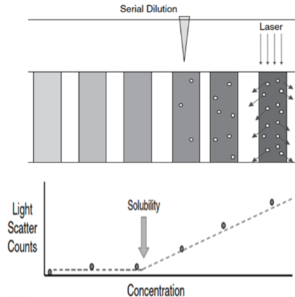

# (PART) 물리화학적 성질 {-} 

# 용해도

\Large\hfill
전예린
\normalsize

## 서론

용해도(solubility)는 약물의 흡수에 관여하는 요소로 생체이용률에 영향을 줄 수 있어 신약개발 과정에서 매우 중요하다. 우리가 정제 혹은 캡슐 등의 형태인 약을 경구로 투여했을 때 유효 성분의 약물은 붕해(disintegration), 용해(dissolution) 및 확산(diffusion) 과정을 거쳐 전신 순환혈에 흡수된다 (그림 \@ref(fig:figure-first)).


<!--{width="5.887119422572178in" height="2.940298556430446in"}-->

```{r figure-first, fig.cap = "(ref:01-01)"}

```

(ref:01-01) 약물의 흡수 과정 [@di2015drug]

약물이 흡수되기 위해서는 반드시 용해되어야 하고, 여기서 약물이 용해되는 정도가 바로 용해도이다. 용해도가 높은 약물은 위장관에서의 약물 농도가 높아지고, 더 많은 양의 약물이 장 상피세포의 표면적과 만나게 되므로 더욱 많이 흡수된다. 즉, 용해도가 높을수록 단위시간 당 단위면적에서 흡수되는 약물의 양이 많아진다 (Fick's law 제 1법칙). 반면, 용해도가 낮은 난용성 약물은 용해 및 흡수가 잘 되지 않아 낮은 생체이용률을 보이게 된다. 따라서 "용해도"는 약물의 흡수에 영향을 주는 매우 중요한 인자라고 할 수 있다.

신약개발 과정 중 약물의 약리, 독성 및 PK에 관련된 다양한 평가를 진행할 때 약물의 용해도는 *in vitro* 실험에 쓰는 농도 결정과 *in vivo* 시험의 부형제 선정에 중요한 단서를 제공할 수 있다. 예를 들면, 난용성 약물의 경우 *in vitro* assay의 buffer나 media에 약물을 고농도로 처리 시 침전 현상으로 인해 농도 의존적인 결과를 확인할 수 없는 경우가 있다. 약효나 독성을 평가하기 위한 *in vivo* 시험에서도 시험결과에 영향을 미치지 않는 부형제를 사용해야 하는 경우라든지, clear solution형태로 주사하여야 하는 정맥투여 PK 시험을 수행할 때 낮은 용해도로 인해 어려움을 겪는 경우도 많다.

이렇듯 용해도는 신약개발 과정에서 필수적으로 확인해야 할 약물의 특성이므로, 이 장에서는 용해도의 개념, 기준 및 영향을 줄 수 있는 인자 등에 대해 자세히 기술하여 이해를 돕고자 한다.

## 용해도 분류 기준

"개발하고자 하는 약물의 목표 용해도가 있는가?" 또는 "약물의 용해도의 좋고 나쁨의 기준이 있는가?"와 같은 질문이 있다면 이에 대한 대답은 "명확한 기준은 없다"이다. 그 이유는 약물의 투과도 (permeability), 평가하고자 하는 약물의 농도나 용량, 시험 항목, 이나 목적 등과 같은 다양한 요인에 따라 목표로 하는 용해도와 그 기준이 결정될 것이기 때문이다. 따라서 이 절에서는 신약개발 단계 별로 용해도의 분류 기준을 나눠보고자 한다.

Drug discovery 단계에서 화합물을 합성하는 연구자들은 통상적으로 다음과 같은 기준으로 용해도를 분류한다 (표 \@ref(tab:table01-01)).

Table: (\#tab:table01-01) Drug discovery 단계에서의 용해도 분류 기준

+---------------------+---------------------+
| Solubility (μg/mL)  | Criteria            |
+=====================+=====================+
| \<10                | Low                 |
+---------------------+---------------------+
| 10-60               | Moderate            |
+---------------------+---------------------+
| \>60                | High                |
+---------------------+---------------------+

Drug development 단계에서는 대한약전 및 USP에 용해도의 분류 기준이 다음과 같이 정의되어 있다. "고체의 경우, 가루로 한 다음 용매 중에 넣고 20±5℃에서 5분마다 30초간씩 세게 흔들어 섞을 때 30분 이내에 녹는 정도"가 용해도이며, 용질 1 g 또는 1 mL를 녹이는데 필요한 용매의 양에 따라 다음과 같이 용해도를 분류할 수 있다 (표 \@ref(tab:table01-02)).

Table: (\#tab:table01-02) 대한약전 및 USP에서의 용해도 분류 기준

+---------------------+---------------------+--------------------------+
| 대한약전 용어       | USP 용어            | 용질 1g 또는 1 mL를      |
|                     |                     | 녹이는데                 |
|                     |                     | 필요한 용매의 양         |
+=====================+=====================+==========================+
| 썩 잘 녹는다        | Very soluble        | 1 mL 미만                |
+---------------------+---------------------+--------------------------+
| 잘 녹는다           | Freely soluble      | 1 mL 이상 10 mL 미만     |
+---------------------+---------------------+--------------------------+
| 녹는다              | Soluble             | 10 mL 이상 30 mL 미만    |
+---------------------+---------------------+--------------------------+
| 조금 녹는다         | Sparingly soluble   | 30 mL 이상 100 mL 미만   |
+---------------------+---------------------+--------------------------+
| 녹기 어렵다         | Slightly soluble    | 100 mL 이상 1000 mL 미만 |
+---------------------+---------------------+--------------------------+
| 매우 녹기 어렵다    | Very slightly       | 1000 mL 이상 10000 mL    |
|                     | soluble             | 미만                     |
+---------------------+---------------------+--------------------------+
| 거의 녹지 않는다    | Practically soluble | 10000 mL 이상            |
+---------------------+---------------------+--------------------------+

마지막으로 신약개발 과정에서 전반적으로 활용되는 용해도의 기준은 Biopharmaceutics Classification System (BCS)에 따른 분류이다 (그림 \@ref(fig:01-02)). 이는 용해도 및 투과도에 따라 다음과 같이 4개의 class로서 약물의 특성을 분류한다.

-   Class I: 높은 용해도, 높은 투과도
-   Class II: 낮은 용해도, 높은 투과도
-   Class III: 높은 용해도, 낮은 투과도
-   Class IV: 낮은 용해도, 낮은 투과도

Class I과 Class III로 분류되기 위한 "높은 용해도"란 "37℃ 및 pH 1.2-6.8 범위에서 1회 최대 복용량 (치료용량)을 30분 이내 용해시키기에 충분한 수용액의 부피가 250 mL 이하"일 때를 의미한다. 
이 때 250 mL은 위장액의 부피 또는 약물 복용 시 먹는 물 한 컵의 양을 기준으로 설정된 것이다.

<!--
{width="4.137998687664042in"
height="3.0930227471566054in"}
-->

```{r 01-02, fig.cap = "(ref:01-02)"}
knitr::include_graphics('media-01/image2.png')
```

(ref:01-02) Biopharmaceutics Classification System (BCS)

## 용해도에 영향을 주는 인자

### 약물의 물리화학적 특성

용해도는 약물의 물리화학적 특성에 따라 달라진다. 일반적으로 약물의 분자량이 낮을수록 용해도가 크며, 수소결합이나 극성 구조를 가진 약물일수록 용해도가 크다. 
그리고 약물의 입자 크기가 작을수록 용매와 반응하는 표면적이 증가하여 용해도가 크다. 
또한 무정형일 때 용매가 분산되기 쉽기 때문에 결정형 대비 용해도가 높다. 
지용성이 높을수록 용해도가 낮으며, 이온화된 약물이 중성분자 보다 잘 녹으므로 pKa 및 용매의 pH 조건에 따라 용해도가 결정될 수 있다.

용해도에 영향을 주는 약물의 물리화학적 인자를 요약하면 다음과 같다.

-   구조 (수소결합, 극성 구조 등 보유 여부)
-   분자량
-   입자크기
-   결정형 및 염
-   친지질도 (Lipophilicity): LogP 혹은 LogD
-   이온화도 (Ionizability): pKa

### 용매 종류

용해도란 용매 조건에서 최대로 용해될 수 있는 약물의 농도를 의미한다. 
즉, "용매 조건"이 달라지면 "용해도" 역시 달라질 수 있으며, 하나의 약물은 용매 조건에 따라 여러 값의 용해도를 가질 수 있다. 
이에 용해도를 명시할 때에는 반드시 용매 조건을 함께 기재해주어야 한다.

용매에 따른 용해도 종류를 크게 분류하면 다음과 같다.

-   수용액에서의 용해도
-   유기용매에서의 용해도
-   pH에 따른 용해도
-   Compendial media에서의 용해도
-   Bio-relevant media에서의 용해도

약물이 주로 흡수되는 위장관의 다양한 조건 (넓은 pH 범위 : pH 1.4-8.0), 음식물의 영향 등)은 약물의 용해도에 많은 영향을 주며, 더 나아가 약물의 생체이용률을 변화시킨다. 
약물의 생체이용률을 예측하기 위해서는 수용액 및 유기용매에서의 용해도보다는, 생리학적 인자들이 반영된 용매에서의 용해도 결과를 활용하는 것이 더욱 적합하다. 따라서 이 절에서는 생리학적 인자들이 반영된 "Compendial media" 및 "Bio-relevant media" 에서의 용해도에 대하여 자세히 기술하고자 한다.

#### Compendial media

위 내 pH는 1.0-3.0이고 소화효소로는 펩신 (pepsin)이 있으며, 장 내 pH 5.7-7.7이고 소화 효소로는 판크레아틴 (pancreatin)이 있다. Compendial media는 위장관의 pH 조건과 유사하면서 소화효소를 함유한 용매이다.
"규격화된 용매"인 compendial media는 USP에 의해 그 규격이 지정되어
있으며, 다음과 같이 절식 상태의 인공 위액 및 인공 장액으로 분류된다 (표 \@ref(tab:table01-03)). 
하지만 compendial media는 위장관 내 오스몰농도, 이온강도, 점도, 표면장력 그리고 음식물에 의한 영향 등을 충분히 반영하지 못한다는 한계점이 있다.

Table: (\#tab:table01-03) 인공 위액 및 인공 장액의 비교

+--------+------------------------------+------------------------------+
| 종류   | 인공 위액                    | 인공 장액                    |
|        | (SGF, Simulated Gastric     | (SIF, Simulated Gastric     |
|        | Fluid)                       | Fluid)                       |
+========+==============================+==============================+
| 정의   | USP에 의해 정의된            | USP에 의해 정의된            |
|        |                              |                              |
|        | 절식 상태의 인공 위액        | 절식 상태의 인공 장액        |
+--------+------------------------------+------------------------------+
| pH     | 1.2                          | 6.7                          |
+--------+------------------------------+------------------------------+
| 구성   | Pepsin, HCl, NaCl, water     | Pancreatin, KH~2~PO~4~,      |
| 성분   |                              | NaOH, water                  |
+--------+------------------------------+------------------------------+

### Bio-relevant media

Bio-relevant media는 compendial media의 한계점인 '오스몰농도, 이온강도,
점도, 표면장력 그리고 음식물에 의한 영향 등'을 모두 반영하여 생체 내
위액 및 장액과 가장 유사하게 만든 용매이다. 이는 음식물에 의한 영향에
따라 위액과 장액을 다음과 같은 4개의 용매로 구분한다 (표 \@ref(tab:table01-04)).

-   FaSSGF (Fasted state Simulated Gastric Fluid): 절식 상태에서의 인공
    위액으로 펩신을 함유하였으며 담즙산(Bile acid) 및 인지질
   (Phospholipid)의 함량이 낮다.
-   FeSSGF(Fed state Simulated Gastric Fluid): 식이 상태에서의 인공
    위액이다. 다만 식이 후 위산 분비에 따라 위 내 펩신의 농도는 시간에
    따라 변화를 보이며, 식이 종류에 따라 위 내 pH 차이가 크기 때문에
    실제 생체 내와 완전히 유사한 인공 위액을 만드는 것은 어렵다. 이에
    영양학적 및 물리화학적으로 식이와 가장 유사한 특성을 갖는 whole milk
    혹은 Ensure® Plus 등을 대체제로 사용한다.
-   FaSSIF (Fasted state Simulated Intestinal Fluid): 절식 상태에서의
    인공 장액으로, 판크레아틴을 함유하였으며 담즙산 및 인지질의 함량이
    낮다.
-   FeSSIF (Fed state Simulated Intestinal Fluid): 식이 상태에서의 인공
    장액이다. 식이 시 절식 대비 장액의 pH가 낮고, 담즙산 및 인지질의
    분비가 증가하는 것을 반영하여 해당 성분들의 함량이 더 높다. 특히
    담즙산 및 인지질은 지용성 약물들을 mixed micelles 형태로 만들어
    가용화 (Solubilization)하는 것에 도움을 준다.

Table: (\#tab:table01-04) Compendial Media 및 Bio-relevant Media의 특성

-------------------------------------------------------------------------------------------------------------------
**Parameters**                  **Compendial                **Bio-relevant                             
                                Media**                     Media**                                    
---------------- -------------- -------------- ------------ ---------------- ------------ ------------ ------------
                                **SGF**        **SIF**      **FaSSGF**       **FeSSGF**   **FaSSIF**   **FeSSIF**

Osmolality                      Cannot mimic                120.7            \-           \~270        \~670
(mOsmol/kg)                     the GI tracts                                                          

Buffer capacity                                             \-               \-           \~12         \~72
(mEq/pH/L)                                                                                             

Surface tension                                             42.6             \-           54           48
(mN/m)                                                                                                 

Ion strength                                                Can mimic the GI                           
                                                            tracts                                     

Viscosity                                                                                              

Food condition                  Fasted         Fasted       Fasted           Fed          Fasted       Fed

pH                              1.2            6.8          1.6              3-6 or       6.5          5.0
                                                                             neutral                   

Composition      Enzyme         Pepsin         Pancreatin   Pepsin           Pepsin       Pancreatin   Pancreatin

                 Bile acid      N.A.           N.A.         ↓                ↑            ↓            ↑

                 Phospholipid   N.A.           N.A.         ↓                ↑            ↓            ↑
-------------------------------------------------------------------------------------------------------------------

### 용해도 측정법

용해도는 측정법에 따라서도 그 값이 달라질 수 있다. 
이에 용해도 데이터를 해석하고 활용하기 위해서는 용해도 측정법에 대해 정확히 이해하는 것이 중요하다. 
용해도 측정법은 크게 "Kinetic solubility"와 "Thermodynamic solubility"로 나눌 수 있다.

#### Kinetic solubility

Kinetic solubility는 DMSO 등의 유기용매에 약물을 완전히 용해시킨 후, 수용성 buffer를 조금씩 첨가하면서 침전이 생기기 시작하는 농도를 측정한다. 소량의 화합물로도 빠르게 측정이 가능하기 때문에 많은 수의 화합물을 소량 합성하게 되는 Drug discovery 단계에서 주로 수행되는 방법이다. 
아래 그림 \@ref(fig:01-03)과 같이 약물을 유기용매에 고농도로 용해한 stock solution을 시험계 완충액에 첨가하는 *in vitro* 시험 방법과도 유사하기 때문에, Kinetic solubility 측정 결과는 *in vitro* assay 농도 설정에도 유용하게 활용될 수 있다.

```{r 01-03, fig.cap = "(ref:01-03)"}
knitr::include_graphics('media-01/image3.png')
```

(ref:01-03) Kinetic solubility 측정법 모식도

<!--
{width="5.948487532808399in"
height="2.0930227471566054in"}
-->

이 때 약물의 침전을 검출하는 방법은 Nephelometry, Turbidimetry 그리고 Direct measurement가 있다 (표 \@ref(tab:table01-05)).
약물을 여러 농도로 용매에 용해시켰을 때, 침전이 생기기 시작하는 농도부터 침전물에 의해 빛이 산란되는데, 이 변곡점을 확인하는 방법이 바로 Nephelometry이다. 
반대로 침전이 생기기 시작하는 농도부터 침전물에 의해 빛의 투과가 감소하는데, 이 변곡점을 확인하는 방법이 Turbidimetry이다. 
마지막으로 Direct measurement란 UV 흡광도와 약물 농도는 선형 비례 관계에 있음을 이용하여 측정된 UV 흡광도로부터 미지의 약물 농도를 정량하는 방법이다.

Table: (\#tab:table01-05) Kinetic solubility의 침전을 검출하는 방법

----------------------------------------------------------------------------------------------------------------------------------------------------
Nephelometry                                          Turbidimetry                                           Direct measurement
----------------------------------------------------- ------------------------------------------------------ ---------------------------------------
                                                         
----------------------------------------------------------------------------------------------------------------------------------------------------

#### Thermodynamic solubility

Thermodynamic solubility는 과량의 결정성 고체 약물을 특정 수용매에 직접
첨가한 후, 평형상태에 도달했을 때 용해된 약물의 농도를 측정한다 (그림 \@ref(fig:01-04)). 
따라서 Thermodynamic solubility는 Equilibrium solubility라고도 한다.
용해도 측정 방법의 표준으로 여겨 지고 있어, 주로 본격적인 개발에 들어가는 단계의 후보물질들에 대해 수행된다. 
그러나 평형상태에 도달하기 위해서는 24시간 이상 충분히 반응시켜야 하므로 용해도 측정에 오랜 시간이 소요되며, 측정 시 많은 양의 약물이 필요하다.

```{r 01-04, fig.cap = "(ref:01-04)"}
knitr::include_graphics('media-01/image7.png')
```

(ref:01-04) Thermodynamic solubility 측정법 모식도

<!--
{width="5.841909448818898in"
height="2.094488188976378in"}
-->

Thermodynamic solubility의 경우 시간이 지날수록 용해된 약물의 농도가 증가하다가 평형상태에 도달하면 일정한 농도로 유지된다. 
반면 Kinetic solubility는 약물이 녹아 있는 유기용매에 수용액을 첨가하면서 약물이 석출되기 시작하는 시점에 측정하므로, 시간이 지날수록 약물의 농도는 감소하는 양상을 보인다 (그림 \@ref(fig:01-05)).

Thermodynamic solubility는 Kinetic solubility에 비해 낮은 용해도 값을 보이는 경우가 많은데, 이는 약물의 결정다형(Polymorphism)이 결정형(Crystal form)인 경우이다. 
결정형인 약물일지라도 Kinetic solubility 측정 시 생기는 침전물은 무정형 (amorphous form)인 경우가 많다. 
그런데 용해도는 일반적으로 결정형보다 무정형이 높기 때문에 두 방법 사이에 용해도 차이가 발생하게 된다.

```{r 01-05, fig.cap = "(ref:01-05)"}
knitr::include_graphics('media-01/image8.png')
```

(ref:01-05) Kinetic solubility와 Thermodynamic solubility의 비교

<!--
{width="3.528966535433071in"
height="2.7761198600174977in"}
-->

## 맺음말

이상으로 ADME의 기초자료: Physicochemical properties에서 용해도에 대해 알아보았다. 
용해도는 약물의 흡수 및 생체이용률에 영향을 주는 약물의 특성 중 하나로, in vitro/in vivo 평가 시 평가 농도 혹은 용량의 결정과 평가 결과에 영향을 미치기도 한다. 
또한 여러 용매 조건에서의 용해도 측정 결과는 임상시험 혹은 품목허가 등을 위해서도 필수적으로 제출해야 하는 자료이기도 하다. 
최근 많은 개발사들이 효력(potency)이 높은 물질을 발굴하려 노력하면서, 화합물의 친지질성 또한 더욱 높아지는 경향을 보이고 있어 용해도의 중요성이 더욱 크게 여겨지고 있다. 
따라서 수용액, 유기용매, pH별 완충액, compendial 및 bio-relevant media 등과 같은 다양한 용매 조건에서의 용해도 평가에 대하여 정확히 이해하고, 이를 적절히 활용하는 것이 중요하다.

**참고문헌**

(편집자: 이 참고문헌은 모두 인용 위치가 본문 내에서 구체적으로 표시되어야 합니다.)

1. Edward H. Kerns and Li Di, Drug-like properties: Concepts, Structure Design and Methods.
2. Lubrizol Life Science, Biopharmaceutical Classification System, 2019 https://3ehzg6104228bwtte1se19g6-wpengine.netdna-ssl.com/wp-content/uploads/2019/10/TB-28-Biopharmaceutical-Classification-System.pdf
3. Everything you need to know about ADME, 3rd Edition, Cyprotex
4. Alskär, L. C. et al., Improved molecular understanding of lipid-based formulations, Digital Comprehensive Summaries of Uppsala Dissertations from the Faculty of Pharmacy 262, 2018.
5. Eleni Rinaki et al., Pharmaceutical Research, 20(12), 2003.
6. Sandra Klein et al., The AAPS Journal, 12(3), 2010.
7. Mark G. Papich and Marilyn N. Martinez, The AAPS Journal, 2015.
8. Edward H. Kerns et al., Current Drug Metabolism, 9, 879-885, 2008.
9. M9 Biopharmaceutics classification system based biowaivers, 2018.
10. Jochen Maas et al., European Journal of Pharmaceutics and Biopharmaceutics, 66, 1-10, 2007.
11. Prachi Shekhawat and Varsha Pokharkar, Acta Pharmaceutica Sinica B, 2016.

