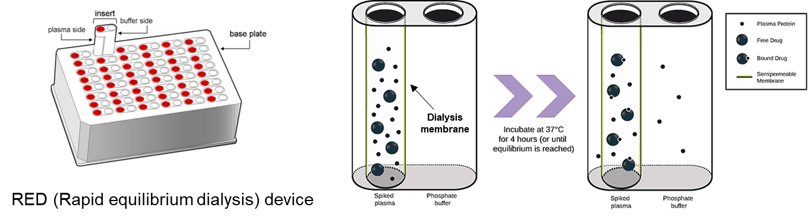
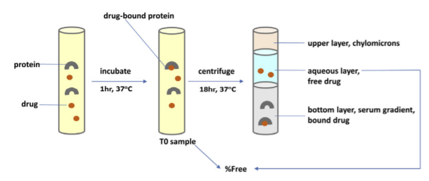

# 혈장단백결합 

\Large\hfill
원상범
\normalsize

## 서론

약을 복용하게 되면 위장관에서 붕해 및 용해되어 전신순환혈에 도달하는 흡수과정을 거치게 되고, 전신순환혈에 도달한 약물은 혈장 내 단백질과 결합하거나 유리된 상태로 존재하게 된다. 
혈장 내 유리 상태의 약물은 생체막을 통과하여 신장이나 간 등 약물이 작용하는 여러 장기로 분포하는 과정을 거치게 되고, 이렇게 분포된 약물 또한 조직 내 단백질과 결합하거나 유리된 상태로 존재한다. 
일반적으로 약효는 유리된 상태의 약물이 표적 작용 부위에서 수용체와 결합하여 활성을 나타내는 것으로 가정하며, 이러한 작용을 자유약물가설 (free drug hypothesis)이라고 한다 (그림 \@ref(fig:03-01)).

```{r 03-01, fig.cap = "(ref:03-01)"}
knitr::include_graphics('media-03/image1.png')
```

(ref:03-01) 자유약물가설의 개략도

약물의 단백결합 평가는 약물동태의 분포와 관련된 평가 중 하나이지만, 그 외 약효의 설명 또는 유효농도 예측, 안전성 평가 및 약물상호작용의 위험도를 평가하는데도 활용된다. 약물의 단백결합은 plasma, tissue 그리고 microsome 등 여러 종류의 단백질에 대하여 평가하지만, 이번 장에서는 혈장에서의 단백결합 평가 방법 및 평가 시 고려해야할 사항에 대해 기술하여 이해를 돕고자 한다.

## 혈장 내 주요 약물 결합 단백질

혈장에서 약물이 주로 결합할 수 있는 단백질로는 albumin,
α1-acid-glycoprotein (AGP), lipoprotein 그리고 globulin 등이 있다. 이 중
albumin은 혈장 내 단백질 구성 성분 중 50% 이상을 차지하고 있어, 혈장 내
단백질 성분 중 가장 많은 양을 차지하고 있다. 또한 albumin은 결합 부위도
8개를 가지고 있으며, 이 중 2개의 결합부위에는 주로 산성이나 중성인
약물들이 결합하게 된다. 다음으로 AGP, lipoprotein 순으로 약물들이 많이
결합하게 되는데, 염기성 약물은 주로 AGP와 결합하고, lipoprotein은 산성,
중성 및 염기성 약물이 일부 결합하며, globulin에는 비타민, 스테로이드가
결합하는 것으로 알려져 있다.

## 혈장 단백결합 평가 방법

혈장 내 단백질과 약물의 결합을 평가하는 방법으로는 형광분석법
(fluorescence spectroscopy), 크로마토그래피 및 모세관 전기영동법
(Chromatography and capillary electrophoresis),
미세투석법(Microdialysis), 평형투석 (Equilibrium Dialysis), 한외여과
(Ultrafiltration) 그리고 초고속 원심분리 (Ultracentrifugation)과 같이
다양한 방법이 개발되어 있다. 가장 일반적으로 사용되는 평가 방법은
평형투석, 한외여과 및 초고속 원심분리 방법이며, 이 세 가지 방법에 대해서
자세히 기술해 보도록 하겠다.

### 평형투석법 (Equilibrium Dialysis)

평형투석법 (Equilibrium Dialysis)은 여러 단백결합 평가 방법 중 gold
standard로 알려져 있다. 아래의 그림 \@ref(fig:03-02)은 평형투석법으로 약물의 혈장
단백결합을 평가할 때 많이 사용되는 RED (Rapid Equilibrium Dialysis)
device를 이용한 시험 방법을 나타낸 것이다. Plasma chamber (Red)에
시험물질을 첨가한 혈장을 넣고, Buffer chamber (White)에는 phosphate
buffer를 넣어준 후 평형상태에 도달할 수 있도록 충분한 시간 (약
4-24시간)동안 37 ℃에서 배양시킨다. 이 과정에서 Plasma chamber 내 약물은
혈장 내 단백질과 결합을 하게 되고, 결합하지 않은 약물만이 반투과성 막을
통과하여 Buffer chamber로 확산 이동을 하게 된다. 그리고 배양이 끝난 후
Plasma 및 Buffer chamber에서의 약물 농도를 측정하여 식 \@ref(eq:eq03-01)과 같이
계산하면, 단백결합율 (fraction bound, f~b~) 및 비결합 분획 (fraction
unbound, f~u~)을 산출할 수 있다.

```{r 03-02, fig.cap = "(ref:03-02)"}

```

(ref:03-02) 평형투석법 (Equilibrium Dialysis)

\begin{equation}
\begin{split}
\% Bound = \frac{Conc.\ of\ \mathbf{buffer}\ chamber}{Conc.of\ \mathbf{sample}\ chamber} \times 100\ (\%) \\
\%\ Unbound = 100 - \%\ Bound \\
f_u = \ \frac{\%\ Unbound}{100}
\end{split}
(\#eq:eq03-01) 
\end{equation}

반투과성 막을 기준으로 Plasma와 Buffer chamber가 구분되어 있기는 하지만,
결합하지 않은 유리 상태의 약물이 막을 자유롭게 이동할 수 있어
평형상태에서의 단백결합율을 측정할 수 있다는 장점이 있다. 이 점이
평형투석법이 단백결합 평가 시 가장 많이 쓰이며 표준시험법으로 여겨지는
이유다. 반면 4시간 이상, 길게는 24시간 이상 배양을 해야 하므로,
혈장에서의 안정성이 낮은 약물인 경우 낮은 회수율 (recovery)이 나올 수
있으며, Plasma 및 Buffer chamber 간 용매의 이동으로 인해 volume의 변화가
나타날 수 있다.

### 한여과 (ultrafiltration) 평가법

한여과 (ultrafiltration) 평가법은 결합하지 않은 약물이 반투과성 막을
통과한다는 점이 앞서 설명하였던 평형투석법과 유사하지만, 평형상태에서
Buffer 내 약물 농도를 측정하는 평형투석법과 달리 일정 시간이 지난 후
원심분리를 통해 막을 통과한 여과액 (filtrate)에서의 약물 농도를
측정한다는 차이가 있다. 그림 \@ref(fig:03-03)과 같이 평가 장치의 하단부에
반투과성 막이 있으며 막의 위쪽에 약물과 혈장을 함께 넣은 후 원심분리를
하면 유리 상태의 약물만이 막을 통과한 여과액에 모이게 된다. 분자량이 큰
혈장 내 단백질 및 이와 결합한 약물은 막을 투과할 수 없다. 이렇게 얻어진
여과액에서의 약물 농도를 측정하고, 원심분리 전 완충액 내 약물 농도를
측정하여 식 \@ref(eq:eq03-02)에 따라 계산하면, 비특이적 결합 (non-specific binding,
NSB) 및 비결합 분획 (fraction unbound, f~u~)을 산출할 수 있다.

```{r 03-03, fig.cap = "(ref:03-03)"}
knitr::include_graphics('media-03/image3.png')
```

(ref:03-03) 한여과 (ultrafiltration) 평가법

\begin{equation}
\begin{split}
NSB = \frac{C_{pre} - C_{post}}{C_{pre}} \\
f_u = \frac{F_f}{[(1-NSB) \times F_e]}
\end{split}
(\#eq:eq03-02) 
\end{equation}

C~pre~: initial conc. of compound before filtration in buffer  
C~post~: recovered conc. of compound after ultrafiltration in buffer  
Ff: the area ratio of compound after ultrafiltration  
Fe: the area ratio of compound before ultrafiltration  
NSB: non-specific binding

한여과 평가법의 장점은 평형투석법과 달리 빠른 시간 내 평가가 가능하므로,
비교적 혈장에서 불안정한 약물도 평가가 가능하다는 것이다. 반면
원심분리에 의해 반투과성 막이 손상되는 경우도 있고, 다른 평가 방법에
비해 비특이적 결합이 높다는 단점이 있다.

### 초원심분리 (Ultracentrifugation) 평가법

초원심분리 (Ultracentrifugation) 평가법은 초원심분리용 tube에 약물과
혈장을 넣고, 장기간 동안 초원심분리 (예: 500,000 g, 10-24 시간) 하여
단백질을 바닥에 침전시킨 후 aqueous layer 내 결합하지 않은 약물의 농도를
측정한다 (그림 \@ref(fig:03-04)). 이 방법은 앞서 설명한 평형투석법이나 한여과
평가법과는 달리 비특이적 결합이 없다는 장점이 있으나, 초원심분리 후
생기는 upper layer (지질층)에 약물이 결합할 수 있어 이보다 아래의
aqueous layer를 취하는 과정에서 시료가 오염될 수 있다. 그리고 고가의
장비인 초원심분리기가 있어야만 이 방법으로 평가가 가능하다는 단점이
있으며, 다른 방법과 비교했을 때 상대적으로 단백결합율이 낮게 평가되는
경향이 있다.

```{r 03-04, fig.cap = "(ref:03-04)"}

```

(ref:03-04) 초원심분리 (Ultracentrifugation) 평가법

## 혈장단백결합 결과 해석 및 활용

혈장단백결합 결과의 해석은 궁극적으로 혈장단백결합율의 높고 낮음을
분류하는 것이다. 혈장단백결합율의 높고 낮음을 나누는 정형화된 기준은
없으며, 시험 기관 혹은 문헌 마다 그 기준이 상이하다. 일반적으로
혈장단백결합율이 90% 이상이면 높은 것으로 분류하지만, 최근 highly
potent한 약물을 개발하는 경우가 많아지면서 이에 따라 lipophilicity가
증가되어, 많은 약물들이 90% 이상의 높은 혈장단백결합율을 보이고 있다.
이러한 추세를 반영하면, 혈장단백결합율이 98%이상이면 high, 90-98%를
moderate 그리고 90% 이하이면 low로 분류하는 것이 보다 현실적인 기준일
것으로 판단된다.

약효 측면에서는 자유약물가설에 따라 혈장단백율이 낮을수록 유리한 약물로
생각할 수 있다. 그러나 유리 상태의 약물은 빠르게 대사 및 배설될 수 있고,
혈장 내 유리 상태의 약물 비율이 낮아지면 결합된 약물이 분리되어 다시
평형을 이루게 되므로 혈장단백결합율의 좋고 나쁨을 판단하기는 어렵다.
약물상호작용 측면에서 보면, 높은 단백결합율을 보이는 약물의 경우
약물상호작용의 위험이 높다고 판단할 수 있다. 예를 들어 단백결합율이
99.9% (fraction bound, f~b~ = 0.999)인 약물이 병용투여한 약물에 의해
단백결합율이 99.8%로 감소된다면, 단백결합율은 0.1%의 차이로 서로 유사한
것처럼 보이나, 이 때 비결합분획 (fraction unbound, f~u~)는 0.01에서
0.02로 2배가 증가된 것이므로 이는 매우 큰 차이라 할 수 있다. 안전역
(Therapeutic index)이 낮은 약물인 경우 위와 같은 약물상호작용에 따른
단백결합율의 변화가 부작용과 연관될 수 있어 주의가 필요하다.

혈장단백결합율은 약효, 독성, 약물상호작용의 위험도를 설명하거나
예측하는데 활용된다. 예를 들면, 자유약물가설에 따라 약물의 혈중 농도에
비결합분획을 곱한 혈중 유리 상태의 약물 농도 (free drug concentration)의
time profile과 *in vitro* 시험에서 구한 IC~50~ 혹은 EC~50~를 비교하여
약효를 설명하거나 약효 시험의 용량을 결정하기도 하고, *in vitro* hERG
assay에서 구한 IC~50~와 비교하여 약물의 심장 독성에 대한 위험도를
평가하기도 한다. 또한 FDA의 약물상호작용 가이던스에 따라 약물상호작용의
위험도를 평가할 때 산출하게 되는 다양한 R value를 구하기 위해서도
혈장단백결합율이 필요하다. 그리고 human PK prediction 과정 중
클리어런스나 생체이용률을 예측하기 위한 IVIVE (In Vitro-In Vivo
Extrapolation)에도 혈장단백결합율이 활용된다.

## 혈장단백결합 평가 시 고려사항

### 낮은 회수율 (Low recovery)

혈장단백결합을 평가하다 보면, 낮은 회수율 문제가 빈번하게 발생된다. 이
때 낮은 회수율이 나타나는 이유로는 약물의 용해도가 낮거나 혈장 내
안정성이 떨어지는 약물인 경우가 있고, 시험 장치의 plastic ware 또는
반투과성 막에 약물이 결합하는 비특이적 결합 (non-specific binding,
NSB)이 있다. 회수율은 해당 시험계에서의 평가 결과에 대한 신뢰성을
판단하는 기준이기 때문에 만약 회수율이 낮게 나왔다면 재시험을 고려하는
경우가 많다.

만약 평형투석법 평가 시 낮은 회수율의 원인이 약물의 낮은 용해도라면 평가
농도를 낮추어 재시험을 수행할 수 있고, 약물의 혈장 내 안정성이 낮았기
때문이라면 평형투석법이 아닌 한여과법 등의 다른 방법으로 평가하는 것을
고려할 수 있다. 다만 문헌에 따르면, 평형투석법의 경우 회수율이
비결합분획 값에 미치는 영향은 없는 것으로 나타났다 (그림 \@ref(fig:fig2table)). 따라서
적어도 전임상 개발 단계가 아닌 lead optimization 단계의 과제라면,
평형투석법 평가 시 낮은 회수율로 재시험을 수행하거나, 이를 해결하기 위해
많은 시간적, 물적 및 인적 자원을 사용하는 것은 바람직하지 않다고
보여진다.

```{r fig2table, fig.cap = "(ref:fig2table)"}
knitr::include_graphics('media-03/image5.png')
```

(ref:fig2table) 회수율이 비결합분획에 미치는 영향

### 높은 혈장단백결합을 가진 약물의 혈장단백결합 평가방법

가장 많이 처방되고 있는 100개 약물들의 혈장단백결합율은 98%이고 (Smith,
Dennis A, 2010), FDA에서 승인된 189개의 약물들 중 많은 약물들의
혈장단백결합율이 99% 이상인 것과 같이 최근 매우 높은 혈장단백결합율을
가진 약물들이 많이 개발되고 있는 추세이다 (그림 \@ref(fig:03-05)).

```{r 03-05, fig.cap = "(ref:03-05)"}
knitr::include_graphics('media-03/image6.png')
```

(ref:03-05)  US FDA에서 승인된 189개 약물의 혈장단백결합율 [@liu2014rational]

이 같은 약물을 평형투석법으로 평가 시 Buffer chamber로 이행되는 약물의
양이 너무 적어, Buffer chamber 내 약물 농도를 분석할 때 정량한계의
문제로 인해 단백결합율을 구하지 못하는 경우가 있다. 이럴 때는 혈장을
희석하여 단백결합율을 평가하는 방법을 고려해볼 수 있다. 주의할 점은 기존
평형투석법과 동일하게 RED device를 이용해 평가를 수행하되, 희석한 혈장을
첨가하여 평가를 진행하므로 비결합분획을 계산할 때 반드시 희석배수를
보정하여 산출해야 한다는 것이다. 아래의 식 \@ref(eq:eq03-03)은 혈장을 10배 희석하여
사용했을 때 비결합분획을 계산하는 수식을 나타낸 예시이다.

\begin{equation}
\% Bound = \frac{Conc.of\ \mathbf{buffer}\ chamber}{Conc.of\ \mathbf{sample}\ chamber} \times 100(\%) \\
\% Unbound = 100 - \% Bound \\
f_{u\ 10\%} = \ \frac{\%_{unbound}}{100} \\ 
f_{u\ 100\%} = \ \frac{{\ \ \ f}_{u\ 10\%}}{10\  - 9*f_{u\ 10\%}}
(\#eq:eq03-03) 
\end{equation}

최근에는 이처럼 매우 높은 혈장단백결합율을 보이는 화합물의 비결합분획을 산출할 수 있도록 고안된 제품 (TRANSIL High Sensitivity Binding Kit^[https://sovicell.com/products/tpb-0400-0135]) 도 있어, 높은 단백결합율로 인해 어려움을 겪을 때 이러한 장치를 활용하는 것도 추천한다.

## 맺음말

이상으로 ADME의 기초자료: Physicochemical properties에서 혈장단백결합 평가 방법 및 평가 시 고려사항에 대해 알아보았다. 혈장단백결합 평가는 분포에 관련된 평가 중 하나이며 단백결합율의 높고 낮음이 약물의 우수성을 나타내지는 않는다. 하지만 혈장단백결합율은 약효, 독성, 약물상호작용, 임상 PK 예측 등 신약개발의 다양한 영역에서 결과의 해석, 용량결정 및 예측에 활용된다. 따라서, 혈장단백결합을 이해하고 적절한 방법으로 평가하는 것이 필요하겠다.

**참고문헌**

(편집자: 이 참고문헌은 모두 인용 위치가 본문 내에서 구체적으로 표시되어야 합니다.)

1. Tonika; Gan, Liang-Shang. Plasma protein binding: From discovery to development. Journal of Pharmaceutical Sciences, 102(9), 2953--2994, 2013. 
2. Van Liempd, Sebastiaan; Morrison, Denise; Sysmans, Leen; Nelis, Paul; Mortishire-Smith, Russell. Development and Validation of a Higher-Throughput Equilibrium Dialysis Assay for Plasma Protein Binding. Journal of Laboratory Automation, 16(1), 56--67, 2011. 
3. Li Di; John P. Umland; Patrick E. Trapa; Tristan S. Maurer. Impact of recovery on fraction unbound using equilibrium dialysis. 101(3), 1327--1335, 2012. 
4. Liu, Xingrong; Wright, Matthew; Hop, Cornelis E. C. A. Rational Use of Plasma Protein and Tissue Binding Data in Drug Design. Journal of Medicinal Chemistry, 57(20), 8238--8248, 2014. 
5. Buscher, Brigitte; Laakso, Sirpa; Mascher, Hermann; Pusecker, Klaus; Doig, Mira; Dillen, Lieve; Wagner-Redeker, Winfried; Pfeifer, Thomas; Delrat, Pascal; Timmerman, Philip. Bioanalysis for plasma protein binding studies in drug discovery and drug development: views and recommendations of the European Bioanalysis Forum. Bioanalysis, 6(5), 673--682, 2014. 
6. Edward H. Kerns and Li Di, Drug-like properties: Concepts, Structure Design and Methods. 
7. Everything you need to know about ADME, 3rd Edition, Cyprotex 
