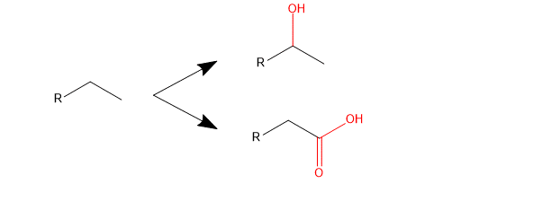
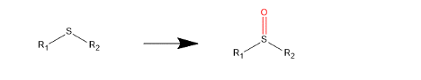
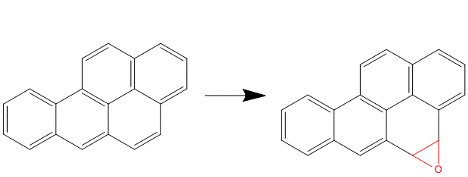
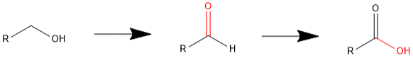
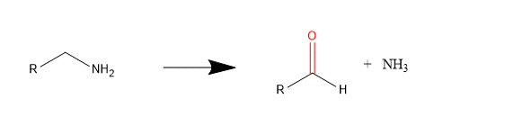
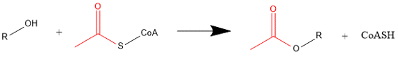
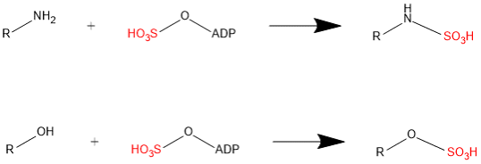
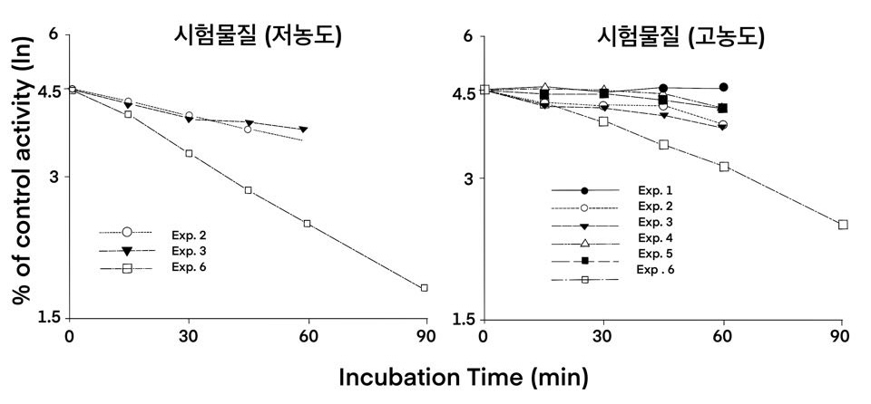

# (PART) 대사 및 수용체 {-} 

# 대사 기질로의 후보 물질 특성 평가

\Large\hfill
배수현
\normalsize

## 서론

대사 과정은 체내에서 약물을 체외로 배출하는 주요한 과정 중 하나이다. 체내에 흡수되어 혈액을 따라 전신 순환하는 약물은 조직으로 이행되며, 간에서 대사(metabolism)되어 담즙이나 소변으로 배설되거나, 대사과정을 거치지 않고 곧바로 배설(excretion)되기도 한다. 대사는 약물의 제거뿐만 아니라, 흡수에도 중요한 역할을 한다. 경구로 약물을 복용하게 되면, 약은 위장관과 간을 통과한 후, 전신으로 흡수되어 조직으로 약물이 이행된다. 이 과정에서 위장관과 간에 존재하는 대사효소에 의해 제거되고 살아남은 약물만 전신으로 흡수될 수 있다. 이를 초회 통과효과(first-pass effect)라고 한다. 약동학에서 약물의 제거(elimination)과정은 대사와 배설을 포함하며, 이 단원에서는 대사 과정에 관하여 자세히 다룰 예정이다.

## 대사 과정

대사 과정은 체내에서 약물이 제거되는데 필수적인 과정이며, 대사 효소에 의하여 약물이 대사체 형태로 변환(biotransformation)되는 일련의 과정을 일컫는다. 약은 이물질(xenobiotics)이며, 대부분의 약물은 친유성(lipophilic)을 띄고 있어 혈장단백과의 결합률이 높은 편인데, 대사 과정을 통해 약물은 친수성(hydrophilic)이 증가하게 되며, 신장으로의 배설이 용이하게 된다. 대사 과정을 통해 대부분의 약은 약리활성 및 독성을 잃게 되나, 때때로 생성된 대사체가 약효 및 부작용을 나타내는 경우가 있다. 이를 reactive metabolite (또는 reactive intermediate)이라고 하며, 주로 생체 내 고분자인 단백질이나 핵산과 공유 결합하여 세포독성, 유전독성 등을 일으킨다. 잘 알려진 예로 아세트아미노펜의 대사과정을 살펴보자(그림 \@ref(fig:04-01)). 아세트아미노펜은 대부분 간에서 phase II 대사를 통해 독성 및 활성이 없는 대사체를 생성하여 체외로 배출되는데, 아세트아미노펜을 과량 복용하게 되면, phase I 대사를 거쳐 높은 반응성을 지닌 reactive metabolite인 *N*-acetyl-*p*-benzoquinone imine (NAPQI)를 생성하게 된다. 생성된 NAPQI가 phase II 대사를 거쳐 글루타치온 포합체를 생성하지 못하면, 간세포 내의 단백질 및 핵산과 결합하여 궁극적으로 세포를 파괴하여 간 독성을 나타낸다.


<!--[](./media-04/image1.png){width="3.7397298775153107in"
height="4.859154636920385in"} -->

```{r 04-01, fig.cap = "(ref:04-01)"}
knitr::include_graphics('media-04/image1.png')
```

(ref:04-01) 아세트아미노펜의 대사과정. (위키피디아 NAPQI 검색 후, 발췌)

대사 과정에는 phase I 대사와 phase II 대사가 있으며, 각각의 과정에 관여하는 대사 효소의 종류와 생성되는 대사체의 성질도 다르다. 일반적으로 phase I 대사를 통해 약물은 산화, 환원, 또는 가수분해 등의 반응을 거치게 되고, 이로 인해 배설 및 다음 대사과정에 용이한 작용기를 가지게 되고, 반응성이 증가하게 된다. 그리고 phase II 대사를 통해 glucuronide, sulfate 등의 포합체가 생성되어 수용성이 증가하게 되며, 신장이나 담즙을 통해 배설되게 된다. 일반적으로 phase I → phase II 대사를 순차적으로 거쳐 약물이 체외로 배설된다고 알려져 있으나, 약물의 구조와 작용기의 유무에 따라 phase I 대사 또는 phase II 대사 각각 거치거나, phase II 대사 이후 phase I 대사과정을 거치는 등 다양한 방법으로 변환되어 체외 배설된다. 다음 장에서 대사 효소에 대하여 자세히 알아보자.

## 대사 효소

앞서 말했듯이, 대사 과정은 크게 phase I 대사 및 phase II 대사로 나뉜다.

### Phase I 대사

Phase I 대사는 약물을 산화, 환원, 또는 가수분해 시켜 약물의 반응성을
증가시키는 과정이다. Phase I 대사의 가장 중요한 대사 효소는 cytochrome
P450 (CYP)이며, 약물의 산화반응에 관여한다. CYP는 헴(heme) 단백질로 간의
소포체(endoplasmic reticulum, ER)에 주로 존재하며, NADPH와 O~2~를 이용한
산화 환원 반응을 통해 약물을 대사체로 변환(주로 산화)시킨다. CYP3A4/5는
간에 많이 분포하고 있지만, 위장관에도 분포하고 있어, CYP3A4/5로 대사되는
약물의 위장관 및 간 초회 통과 효과에 영향을 미친다.

CYP는 다음과 같이 명명된다(그림 \@ref(fig:04-02)). 염기서열이 40% 이상
상동(homology)하면 숫자를 이용하여 같은 'family'로 분류하며, 그 중에서도
55% 이상 상동이면 'subfamily'가 같으며, 이는 알파벳 대문자로 표시한다.
그리고 'specific isoform'을 숫자로 표시하여 동일한 CYP 효소 (동효소,
isozyme)임을 명명한다. 그리고 'allele number'를 통해 CYP 동효소의
유전형을 표기한다. 야생형(wild type)의 경우, 주로 \*1으로 표기되며,
아미노산 변이 및 돌연변이에 의해 유전형은 \*2, \*3, \*13등과 같이
표기된다.

약물 대사에 관여하는 주요한 CYP 동효소는 CYP1A2, CYP2B6, CYP2C8, CYP2C9,
CYP2C19, CYP2D6, CYP3A4/5이며, 신약개발 시 미국 Food and Drug
Administration (FDA) 및 European Medicines Agency (EMA)에서는 위의
동효소에 대한 대사능 및 저해(유도)능을 확인하도록 가이던스에 권고하고
있다 [@studies2020cytochrome;@european2012guideline].

```{r 04-02, fig.cap = "(ref:04-02)"}

```

(ref:04-02) CYP 동효소의 명명법

Phase I 대사 효소 중 하나인 flavin-containing monooxygenase (FMO)에
의해서도 약물이 대사된다. FMO를 매개하는 약물상호작용의 경우는 흔지
않으며, 주로 유전형에 따른 FMO의 발현 정도가 약물의 대사에 영향을
미친다. FMO 동효소 중에서 FMO3는 간에 주로 분포하며, 유전적 다형성을
지니며, amphetamine, tamoxifen, clozapine, phenothiothiazine 계열 약물의
대사에 관여한다. FMO1은 주로 신장에 분포하여 신장으로 배설되는 약물의
대사에 중요한 역할을 하는 것으로 알려져 있다.

Phase I 대사 중 산화 과정에 대하여 알아보자. 주로 CYP 동효소에 의해
oxidation, dealkylation, hydroxylation 등이 일어나며, CYP 외의 FMO와
monoamine oxidase (MAO) 등에 의한 산화 과정도 이에 포함된다. 이 과정들에
대한 예는 표 \@ref(tab:table04-01)에 자세히 나와 있다.

Table: (\#tab:table04-01) 약물의 대사 과정 - 산화 과정

| Reaction | Structural formula | Drugs |
| --- | --- | --- |
| I. CYP-dependent oxidations  |  |  |
| Aliphatic hydroxylation   |  | Barbiturates, cyclosporine, ibuprofen |
| |  | |
| Aromatic hydroxylation |               | Phenytoin, propranolol |
| N-dealkylation |               | Sildenafil, diazepam |
| O-dealkylation |               | Codeine     |
| S-oxidation |               | Cimetidine, phenothiazine |
| N-oxidation |               | Quinidine   |
| Desulfuration |              | Thiopental  |
| Epoxidation |              | Carbamazepine |
| II. CYP-independent oxidations  | | |
| Alcohol dehydrogenation, Aldehyde dehydrogenation |              | Ethanol, pyridoxine |
| Oxidative deamination |              | Histamine, norepinephrine |
| Decarboxylation |              | Levodopa    |

약물의 구조에 따라 산화 과정 뿐만 아니라, 환원 및 가수분해 과정을
통해서도 약물이 대사된다(표 \@ref(tab:table04-02)). 환원에 의한 대사과정은 산화 및 가수분해 보다 흔치 않다. 
가수분해는 주로 간에 존재하는 esterase (ES)에 의해 ester hydrolysis 되며, 약물의 구조 상 amide hydrolysis, epoxide hydrolysis 될 수 있다.

Table: (\#tab:table04-02) 약물의 대사 과정 - 환원, 가수분해 과정

| Reaction   | Structural formula                       | Drugs       |
| --- | --- | --- |
| I. Reduction |  | Chloramphenicol, methadone, naloxone |
| II. Hydrolysis       |               | Aspirin, procaine, lidocaine, indomethacin, irinotecan |

### Phase II 대사

Phase II 대사는 모약물 및 대사체의 작용기에 glucuronide, sulfate,
acetate, glutathione 등의 포합체를 붙여 약물의 수용성을 증가시킨다. 이
과정을 통해 약물은 소변이나 담즙을 통해 체외로 배설된다. 대표적인 대사
효소로는 uridine 5\'-diphospho-glucuronosyltransferases
(UDP-glucuronosyltransferases, UGTs), sulfotransferases (SULTs),
*N*-acetyltransferases (NATs), glutathione S-transferase (GST) 등이
있다.

글루크론산화(glucuronidation)은 UGT 동효소에 의해 일어나며, UGT는 UGT1과
UGT2의 2개의 family로 분류된다. 기질로는 bilirubin, irinotecan의
활성대사체인 SN-38 (이하 UGT1A1), morphine, efavirenz (이하 UGT2B7) 등이
대표적이다. 글루크론산화된 대사체는 소변 또는 담즙으로 배설되는데,
담즙으로 배설된 대사체는 소장에 존재하는 β-glucuronidase에 의해 포합체가
떨어져나가 모약물 형태로 다시 위장관을 통해 재흡수 될 수 있다.

황산화(sulfation) 및 아세틸화(acetylation)은 각각 SULT와 NAT에 의해
일어나며, acetaminophen과 isoniazid가 각각 SULT와 NAT의 기질로 알려져
있다.

각 대사 과정들에 대한 예는 표 \@ref(tab:table04-03)에 자세히 나와 있다.

Table: (\#tab:table04-03) 약물의 대사 과정 - Phase II

  ------------------------------------------------------------------------------------------
  Reaction          Structural formula                                      Drugs
  ----------------- ------------------------------------------------------- ----------------
  I.                {width="3.6041666666666665in"   Diazepam,
  Glucuronidation   height="0.8645833333333334in"}                          digoxin,
                                                                            acetaminophen,
                                                                            SN-38, efavirenz

                    {width="2.941431539807524in"    
                    height="1.8168383639545056in"}                          

  II\. Acetylation  {width="3.1354166666666665in"   Isoniazid,
                    height="0.5416666666666666in"}                          sulfonamide

                    {width="3.209925634295713in"    
                    height="1.145132327209099in"}                           

  III\. Sulfation   {width="3.125in"                Methyldopa
                    height="0.65625in"}                                     

  IV\. Glutathione  {width="2.7157360017497814in"   Acetaminophen,
  conjugation       height="1.3023468941382328in"}                          valproic acid,
                                                                            busulfan
  ------------------------------------------------------------------------------------------

## 대사 특성 평가

약물 대사는 주로 간에서 일어나며, 다양한 *in vitro* 실험을 통해 약물이
어떤 대사효소를 통해 얼마나 대사되는지 확인할 수 있다. 이 단원에서는 *in
vitro* 실험에 사용되는 다양한 시험계의 종류와 그 특성, 대사 특성을
평가하는 시험법, 시험에서 얻을 수 있는 파라미터와 각 파라미터가 의미하는
바에 대하여 순차적으로 알아보자.

### In vitro systems

약물의 대사를 확인하는 시험계는 세포계(intact cell system),
준세포분획(subcellular fractions), 재조합 효소(recombinant enzyme)
등으로 나눌 수 있다.

#### Intact cell systems

대사를 확인하는 세포계는 주로 간세포((cryopreserved) primary
hepatocytes)를 일컫는다. 간세포 자체는 계대 배양이 불가능하여 시험
비용이 비싸며, 사람마다 발현되어 있는 대사효소 및 수송체의
양(abundance)이나 활성(activity)이 상이하기 때문에, 지속적으로 동일한
공여자(donor)의 간세포를 안정적으로 얻을 수 없는 제한점이 있다. 이러한
이유로 간세포 외의 다양한 세포주를 활용하는 대체 실험법이 제안되고
있으며, 효능 평가 및 독성 평가에는 사람 간암 세포주인 HepG2, HepaRG 등을
사용하기도 한다. 하지만, 대사 특성을 평가하는 시험의 경우에는 대사효소
및 수송체 발현 정도가 간암 세포주와 간세포와 다르기 때문에, 대사 특성
평가에 사용되기에는 현재까지 적절하지 않다.

간세포에는 phase I 대사효소 뿐만 아니라, phase II 대사효소가 전부
존재하기 때문에, 종합적인 대사능(intrinsic clearance, CL~int~)^\*^을
관찰할 수 있다. 또한, 간세포 내로 약물이 수동확산 또는
수송체(transporter)를 통해 간으로 능동수송(active transport)되어
들어가는 속도(CL~int,pd~, CL~int,uptake~)를 측정할 수 있다. 세포
투과성(permeability)이 낮은 약물의 경우, uptake transporter에 의해
간세포 내로 능동수송 된 후 대사되므로, 이러한 수송체의 기질성 여부가
약물의 간대사에 영향을 미칠 수 있다. 간세포 배양방법 (예.
Sandwich-cultured hepatocytes)에 따라 약물의 담즙 배설도
확인(CL~int,bile~) 할 수 있다.

#### Subcellular fraction

준세포분획(subcellular fractions)은 세포를 homogenate하여 원심분리 후,
얻은 분획을 말한다(그림 \@ref(fig:04-03)). 간 대사에 주로 사용되는 분획은 microsome,
cytosol, S9 등이며, 각각의 분획에는 들어있는 대사효소의 종류가 달라,
약물의 특성에 맞게 선택하여야 한다. Microsome에는 CYP 동효소와 UGT
동효소가 있어, 각각의 대사효소에 의한 약물의 대사능을 평가하는데 가장
많이 사용된다. Microsome과 cytosol의 경우, 포함하고 있는 대사효소의
종류가 다르므로, 약물의 구조 및 예상되는 대사경로에 따라 적절한 실험계를
사용하여야 한다. 각 준세포분획에 포함되어 있는 대사효소는 그림 \@ref(fig:04-04)에 잘
정리되어 있다.

```{r 04-03, fig.cap = "(ref:04-03)"}

```

(ref:04-03) 준세포분획(subcellular fraction)

```{r 04-04, fig.cap = "(ref:04-04)"}
knitr::include_graphics('media-04/image22.png')
```

(ref:04-04) 각 준세포분획(subcellular fraction)에 발현되어 있는 대사효소

#### Recombinant enzyme

재조합효소(recombinant enzyme)는 특정 대사효소를 인위적으로 과발현시켜
만든 실험계이다. 약물이 특정 대사효소로 얼마나 대사되는가를 평가할
때(reaction phenotyping study) 주로 사용된다. CYP 동효소 뿐만 아니라,
UGT 동효소, SULT, CES 등 다양한 재조합효소를 판매하고 있으며, 필요에
따라 실험자가 직접 과발현시킨 재조합효소를 만들어 실험에 사용할 수도
있다. 다만, 동일한 재조합효소의 농도를 실험에 사용하였더라도, 효소의
양과 활성은 재조합효소를 만들어내는 실험방법 및 상용화된 재조합효소를
판매하는 제조사마다 다르기 때문에, 필요에 따라 환산계수를 반영하여
CL~int~를 산출하여야 한다.

## 대사평가 실험을 통해 얻을 수 있는 in vitro 대사 파라미터

대사평가 실험을 통해 얻을 수 있는 in vitro 파라미터는 CL~int~ 또는 K~m~
및 V~max~이다. 각 파라미터들은 다음과 같은 방법으로 얻을 수 있다.

### Substrate-depletion 법

In vitro 대사평가 실험에서 시간에 따른 기질약물의 소실량을 측정하는
방법이다. 그림 \@ref(fig:04-05)에서와 같이, 시간에 따라 기질 약물의 농도가
감소한다면, 실험계에 사용된 대사 효소의 기질임을 알 수 있다. 예를 들어,
microsome에 NADPH를 첨가하여 실험을 진행하였다면, 시험약물은 ES,
carboxylesterase (CES), CYP, FMO 등의 기질일 가능성이 높으며, 재조합
CYP3A4에서 아래의 결과를 얻었다면, 시험약물은 CYP3A4의 기질이다. 또한,
hepatocyte에서 실험 후, 아래의 결과를 얻었다면, 시험약물은 간에서
대사되는 약물이다. 이런 식으로, 실험 목적에 맞게 in vitro system을
선택하여 실험 후, 시험물질의 대사를 확인할 수 있다.

```{r 04-05, fig.cap = "(ref:04-05)"}
knitr::include_graphics('media-04/image23.png')
```

(ref:04-05) Substrate-depletion 법을 이용하여 얻을 수 있는 data (예)

Substrate-depletion 법을 통해서, 어떤 대사효소로 대사되는지 확인할 수
있을 뿐만 아니라, 얼마나 대사되는지도 확인할 수 있다. 시간에 따른
기질약물의 소실속도가 일차반응속도를 따른다면, y축을 log로 변환하면 그림 \@ref(fig:04-05)의 오른쪽과 같이, 그래프가 직선을 나타낸다. 이때의 기울기는
제거속도상수(k)이며, 여기에 실험에 사용된 buffer의 양(mL)과 실험에
사용된 단백질의 양(mg)을 반영하면, CL~int~를 구할 수 있다.


\begin{equation}
CL_{int} = \frac{-ln\frac{[S]_2}{[S]_1}}{t2 - t1 \text{ (min)}} \cdot \frac{V\text{ (ml)}}{P\text{ (mg)}}
(\#eq:eq04-01) 
\end{equation}

이 때, 기질은 K~m~ 이하의 농도를 선택하는 것이 중요하다. 대부분의
기질-효소 반응은 Michaelis -Menten (M-M) kinetic을 따르며, K~m~ 이하의
저농도에서는 1차반응, K~m~ 이상의 고농도에서는 0차 반응을 보인다.
Substrate-depletion 법은 약물의 대사속도를 일차반응속도로 가정하고 있기
때문에, 정확한 CL~int~를 구하기 위해서는 저농도를 기질의 농도로 선택하여
실험하여야 한다. 하지만, 신약개발 초기단계의 경우, 어떤 대사효소에 의해
얼만큼 대사되는지에 대한 정보가 없어 기질의 특정효소에 대한 K~m~값을 알
수 없으므로, 기질 농도는 정량가능한 범위에서 최대한 낮은 농도를 선택하는
것이 좋다. 높은 농도에서 substrate-depletion법을 통해 CL~int~를
산출하였다면, 그 약물의 대사능이 underprediction 될 수 있다.

### Metabolite-formation 법

대사체를 정량분석기기(LC-MS/MS 등)를 통해 정량적으로 농도 분석할 수
있다면, 기질 약물농도에 따른 대사체 생성량을 측정할 수 있다. 그림 \@ref(fig:04-06)처럼, 기질-효소 반응은 M-M kinetic을 통해 대사체를 생성하며,
기질농도에 따라 대사효소의 포화 등으로 인해 대사체 생성 속도가 달라질 수
있다. Metabolite-formation 법을 통해 시험물질을 대사시키는 대사효소를
특정할 수 있으며, substrate-depletion 법과 달리 기질 농도에 따른 대사체
생성속도를 확인하기 때문에, 대사효소에 대한 시험물질의 V~max~와 K~m~을
산출할 수 있다. 실험계는 간세포, 준세포분획, 재조합효소 등 실험목적에
맞게 다양하게 선택할 수 있다. Metabolite-formation 법을 통한 대사평가는
주대사체(major metabolite)가 생성되거나, 대사체에 대한 구조확인
시험물질의 대사체 표준품(표준시료)이 확보되어야 하기 때문에, 신약
개발단계에서 metabolite profiling을 통한 대사체 동정 이후에 수행되는
경우가 일반적이다.


```{r 04-06, fig.cap = "(ref:04-06)"}

```

(ref:04-06) Metabolite-formation법을 이용하여 얻을 수 있는 data (예)

## 대사평가 실험법

약물 대사 평가 방법에 대하여 알아보자. 평가하고자 하는 대사효소가
포함되어 있는 실험계를 선택할 수 있다.

### 대사안정성(metabolic stability) 평가 실험

신약개발 시 후보물질 도출을 위한 초기 단계에 많이 활용된다. 일반적으로
microsome을 이용하지만, 평가하고자 하는 목적에 따라 다른 실험계를 선택할
수 있다. Microsome을 이용할 경우, 첨가하는 cofactor와 chemical inhibitor
종류 및 pre-incubation 조건에 따라 다양한 효소의 대사능을 선택적으로
관찰할 수 있다. 각 실험 조건에 맞게 약물이 들어있는 튜브를 준비하여,
37℃에서 incubation 하면서 시간에 따라 tube내의 약물의 농도를 측정하여
tube에서 사라지는(대사되는) 약물의 양을 확인한다. 표 \@ref(tab:table04-04)를 자세히
살펴보자. G1은 평가약물과 buffer만 있으므로, 약물이 실험에 사용되는
buffer에서 chemical degradation이 있는지 확인하는 대조군이다. G2는
buffer와 microsome을 포함하고 있으며, cofactor 없이 가수분해가 가능한 ES
및 CES에 의한 대사를 관찰할 수 있다. G3은 G2에 NADPH를 추가하였으며, 이
경우는 가수분해효소 외 CYP와 FMO에 의한 대사를 관찰할 수 있다. G4는 G2에
NADPH 대신 UDPGA (+alamethicin)을 첨가하였으며, 이는 UGT에 의한 대사를
관찰하기 위함이다. G1\~G4의 조건은 대사안정성 실험시 필수적으로 포함하여
수행하기를 권장하며, 여기에 더하여, FMO 대사 가능성이 있다면, G5와 G6
실험을 추가하는 것을 추천한다. G5는 45℃에서 30분가 pre-incubation하여
열에 약한 microsome 내의 FMO를 비활성화 시키게 되며, G6는 CYP 동효소의
chemical inhibitor인 SKF525A를 첨가하여, CYP에 의한 대사능을 배제시킬 수
있다.

Table: (\#tab:table04-04) 대사안정성 평가 실험법의 예

+------------+--------+--------+--------+--------+--------+--------+
|            | **G1** | **G2** | **G3** | **G4** | **G5** | **G6** |
+============+========+========+========+========+========+========+
| Buffer     | O      | O      | O      | O      | O      | O      |
+------------+--------+--------+--------+--------+--------+--------+
| Microsomes | X      | O      | O      | O      | O      | O      |
+------------+--------+--------+--------+--------+--------+--------+
| NADPH      | X      | X      | O      | X      | O      | O      |
+------------+--------+--------+--------+--------+--------+--------+
| UDPGA      | X      | X      | X      | O      | X      | X      |
| (+ala-     |        |        |        |        |        |        |
| methicin)  |        |        |        |        |        |        |
+------------+--------+--------+--------+--------+--------+--------+
| SKF525A    | \-     | \-     | \-     | \-     | \-     | O      |
+------------+--------+--------+--------+--------+--------+--------+
| Pre-       | 37℃,   | 37℃,   | 37℃,   | Ice,   | 45℃,   | 37℃,   |
| incubation |        |        |        |        |        |        |
|            | 5 min  | 5 min  | 5 min  | 30 min | 30 min | 5 min  |
+------------+--------+--------+--------+--------+--------+--------+
| 평가가능한 | X      | ES,    | ES,    | ES,    | ES,    | ES,    |
| 대사효소   |        | CES    | CES,   | CES,   | CES,   | CES,   |
|            |        |        | CYP,   | UGT    | CYP    | FMO    |
|            |        |        | FMO    |        |        |        |
+------------+--------+--------+--------+--------+--------+--------+

위의 방법을 통해 수행된 실험 결과는 그림 \@ref(fig:04-07)와 같이 얻을 수 있다. 각
군에서 특정 대사효소에 의해 대사가 일어난 경우, 시간에 따라 약물의
농도가 줄어들기 때문에, 표 \@ref(tab:table04-04)의 G6과 같은 결과가 나타나며, 그렇지
않은 경우는 시간에 따른 약물 농도의 변화가 관찰되지 않는다.
Substrate-depletion 법을 사용하기에, 시험물질의 농도는 가능한 낮은
농도에서 실험하기를 권장한다. 그리고 표 \@ref(tab:table04-04)의 실험 조건들은 일반적으로
많이 사용되는 방법이며, 시험물질의 구조에 따라 대사가 일어날 가능성이
있는 대사효소를 평가할 수 있도록, 실험 조건을 적절히 변경하여 평가에
활용할 수 있다.


```{r 04-07, fig.cap = "(ref:04-07)"}

```

(ref:04-07) 대사안정성 평가 실험 결과 (예)

### Reaction phenotyping 평가 실험

Reaction phenotyping 실험은 일반적으로 metabolic stability 실험 후에
수행한다. 이 실험은 특정 대사효소계에 의해 대사됨을 확인한 후, 그 중에
특정한 대사효소를 찾아내기 위함이다. 예를 들어, 대사안정성 실험을 통해
시험물질이 CYP 동효소에 의해 대사됨을 확인하였다면, 그 이후에 reaction
phenotyping 실험을 통해 CYP 동효소 중에서 어떠한 효소로 대사되는지 특정
대사효소를 찾아낼 수 있다. 이 뿐만 아니라, total in vivo CL 중에서 특정
대사효소에 의해 대사되는 정도(기여도) (i.e., the fraction of drug
metabolized by a specific enzyme, f~m~)를 확인할 수 있다. CYP에 의한
약물 대사가 total in vivo CL의 25% 이상을 차지하면, 특정 CYP 효소를
확인(identification)하는 것이 권장된다[@studies2020cytochrome}. Reaction phenotyping
평가에는 1) recombinant enzymes (i.e. CYP 동효소, UGT 동효소 등) 이용,
2) enzyme-selective chemical inhibitors or antibodies 이용 등의 실험법이
사용될 수 있으며, 미국 FDA는 1)과 2)의 방법을 모두 사용하기를 권고하고
있다[@studies2020cytochrome}.

재조합효소를 사용하는 실험법은 시험물질의 구조와 metabolic stability
자료를 바탕으로 수행될 수 있다. CYP 동효소들, UGT 동효소들, MAO, FMO,
CES 등 대사 가능성이 있는 모든 효소에 대하여 확인할 수 있으며,
substrate-depletion 방법과 metabolite-formation 방법 둘 다 사용
가능하다.

Recombinant CYP 동효소를 이용한 reaction phenotyping의 예를
살펴보자(그림 \@ref(fig:04-08), \@ref(fig:04-09), \@ref(fig:04-10)). 그림 \@ref(fig:04-08)에서와 같이, 재조합 CYP 동효소 각각에
시험물질을 넣고 일정시간동안 incubation 후, 시험물질의 소멸양을 확인하여
특정 대사효소를 찾아낼 수 있다. 생성 대사체에 대한 정보가 없다면, 이와
같은 방법을 사용할 수 있다. 그림 \@ref(fig:04-08)의 결과에서는 실험에 사용된 물질은
주로 CYP3A4와 CYP3A5를 통해 대사됨을 확인할 수 있다.


```{r 04-08, fig.cap = "(ref:04-08)"}
knitr::include_graphics('media-04/image27.png')
```

(ref:04-08)  Recombinant CYP 동효소를 이용한 reaction phenotyping 예 (substrate-depletion method). rCYP, recombinant CYP; HLM, human liver microsome

대사체의 분자량과 LC-MS/MS 분석조건을 알고 있다면, 그림 \@ref(fig:04-09)에서와 같이
각 CYP 동효소를 통해 생성되는 대사체를 확인할 수 있다. 이 경우, 대사체의
절대 생성량을 측정한 것이 아니라, 분석기기에서 생성된 대사체의 peak
면적을 확인한 것이므로, y축이 relative intensity임을 참고하자.

```{r 04-09, fig.cap = "(ref:04-09)"}

```

(ref:04-09) Recombinant CYP 동효소를 이용한 reaction phenotyping 예 (metabolite-formation method) [@yanakakis2012biotransformation]. 각 CYP 동효소를 이용해 생성되는 대사체의 상대량(relative intensity)를 확인할 수 있다.

대사체의 표준품을 이용한 검량선 작성이 선행되어야 정확한 생성량과 관련된
파라미터들을 알 수 있다. 이의 예는 그림 \@ref(fig:04-10)에 잘 나와 있다. 시험물질의
CYP3A4에 의해 대사되어 생성되는 대사체인 M1과 M2의 생성량을 기질 약물의
농도에 따라 확인하였으며, 이를 통해 특정 대사효소에 의해 생성되는 특정
대사체의 생성을 설명하는 파라미터인 K~m~과 V~max~를 얻을 수 있다. 이를
통해, 시험물질의 대사능을 정량적으로 확인할 수 있으며 (K~m~, V~max~,
CL~int~), 이를 통해 f~m~을 계산할 수 있다. 여기서 한가지 주의할 점은,
재조합효소를 이용하여 정량적인 값(CL~int~)을 산출하고, 이를 *in vitro* -
*in vitro* extrapolation (IVIVE)를 통해 in vivo CL 계산에 활용하고자 할
때에는 ISEF 또는 RAF 등의 적절한 환산계수를 반영하여야 한다.

```{r 04-10, fig.cap = "(ref:04-10)"}
knitr::include_graphics('media-04/image29.png')
```

(ref:04-10) Recombinant CYP 동효소를 이용한 reaction phenotyping 예 (metabolite-formation method) [@yanakakis2012biotransformation]. 대사체의 표준품 확보가 가능한 경우

## 맺음말

신약개발 과정에서 in vitro 약물대사를 평가 실험은 필수적이다. 임상진입
전, 후보물질의 대사 특성을 잘 파악하고 질 높은 정량적인 파라미터들을
확보해 두는 것은 임상개발 과정에서 시간과 비용을 줄이는데 중요한 역할을
할 수 있다. 대사 평가 데이터는 임상진입을 위한 허가기관 제출 자료로
확보되어야 하며, 그 외, 임상 진입 후, PBPK 모델 개발에 필수적으로
활용되어, 병용약물과의 약동학적 상호작용 평가, 다양한 환자군(예. 간 및
신장 기능 저하 환자군, 등)에서의 약동학 평가, 및 인종간의 약동학 차이
등의 평가에 사용될 수 있다.

