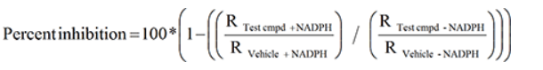

# 후보 물질의 대사 억제 특성 평가

이소진

## 서론

이 장에서는 개발하는 약물이 과연 대사를 억제(metabolic inhibition)하는
약물인지 확인하고, 억제제(inhibitor)라면 어떤 대사 억제 특성을 가지는지 확인하는
방법에 대하여 살펴본다. 대사 억제의 종류는 크게 두가지로 구분되며, 이는
(가역적 억제)reversible inhibition와 시간 의존적 억제(time-dependent inhibition, TDI)로 나뉜다. 각각의
대사 억제 종류에 따른 inhibition assay와 실험 방법들 그리고 이를 통해
얻어지는 핵심 정보들(i.e. inhibition type, inhibition parameters)가
무엇인지 알아보기로 한다. 그리고, 그 결과를 해석하는 방법과 활용(i.e. DDI
prediction)에 대해 살펴보겠다.

## 신약 개발 주기 안에서의 in vitro inhibition assay의 중요성 및 활용

약물 간 상호작용(Drug-Drug Interaction,DDI) 평가는 중요하며, 특히 여러 종류의 약물(polypharmacy)을 장기간 병용 투약하는
만성질환을 가진 환자에서 눈여겨 보아야 한다. 억제제 역할을 하는
약물은 victim drug 와 병용투여시 victim drug의 체내 약물 농도를 높게
만들고, 이에 따른 이상반응이나 독성이 나타날 수 있다. 따라서 후보물질의
대사 억제 특성 평가는 환자의 안전한 약물 치료를 위해 반드시 먼저
수행되어야 하는 부분이다.

```{r 05-01, fig.cap = "(ref:05-01)"}
knitr::include_graphics('media-05/image-1-2.png')
```

(ref:05-01) Perpetrator(inhibitor 또는 inducer) 와 victim drug 병용투여 시의 약물농도

Victim (substrate): Drug whose PK is affected,  
Perpetrator: Drug that is affecting PK of victim

대사 억제는 크게 두 종류로 나뉘어진다. 가역적 억제는 competitive, noncompetitive 그리고
uncompetitive로 세분화할 수 있다.
각 종류 별 어떤 억제제로서 작용하는지를 여러가지 실험으로 확인할 수 있다. DDI 예측시 다양한 방법(static model, 
mechanistic static model, 그리고/또는 PBPK model)을 통해 실험에서 얻어진 억제와 관련 파라미터 값들을 적용하고
궁극적으로 DDI를 예측하는데 사용한다.

In vitro 정보를 기반으로 한 DDI 평가는 In vitro ADME 연구내에서
대사 연구(Metabolism study)에 해당하는 부분으로, 대사 연구 범주 내에는 DDI
평가 외에도 metabolic stability test, metabolite profiling, 그리고 CYP
isozyme profiling 등이 있다. 이와 같은 metabolic DDI 평가에는 Cytochrome
P450 억제평가, 유도평가 및 activation/suppression 평가가
포함된다.

신약개발 주기에서 in vitro DDI 평가, 특히 대사 억제 평가는 언제 이루어
지는지 알아보자. In vitro inhibition assay는 drug discovery 단계에서부터
수행되어야 한다. Drug discovery의 lead optimization 과정에서 수많은 약물
후보를 기반으로 개발약물이 대사 억제제 인지 대규모로 스크리닝하는 과정을
거친다(i.e. 일반적으로 combined approach를 사용하여 대사 억제를 평가하며,
강한 시간 의존적 억제제(Time-dependent inhibitor)는 개발에서 제외하는 전략을 많이 취함). 이후에 drug
development 단계로 와서 선택된 몇 개의 lead compound에 대해서는 보다 더
구체적인 정보를 얻기 위한 inhibition assay를 진행해야 한다. 임상 시험에
가까워질수록 in vitro inhibition assay는 GLP 와 비슷한 수준에서
수행되어야 한다. 이와 같은 약물개발 주기에서의 in vitro 정보를 활용한
DDI 평가는 FDA 가이던스와 EMA 가이드 라인에서도 추천하고 있다.

```{r 05-02, fig.cap = "(ref:05-02)"}
knitr::include_graphics('media-05/image3.png')
```

(ref:05-02) 신약 개발 주기에 따른 in vitro DDI 평가

<!--
{width="4.198678915135608in"
height="3.3409722222222222in"}

그림 . 신약 개발 주기에 따른 in vitro DDI 평가
-->


## 대사 억제 작용 메커니즘

FDA에서 확인하기를 권고하는 주요 CYP isoform 은 7가지로 아래와
같다:

CYP1A2, CYP2B6, CYP2C8, CYP2C9, CYP2C19, CYP2D6, CYP3A

대사 억제 작용의 종류는 크게 두가지로 나눌 수 있으며, 가역적 억제는 direct inhibition이라고도 불리우며,억제제-효소가
약하게 결합한 경우로, 빠른 시간 내에 분리가 일어난다. 그리고 바로 효소 활성이 회복된다. 
가역적 억제는 억제제와 대사 효소의 결합 양상에 따라 여러 종류로 아래와 같이 세분화될 수 있다:

-   경쟁적 저해(Competitive inhibition):  억제제와 기질이 동일한 활성 부위(active
    binding site)에 결합이 가능하며 이를 놓고 경쟁하는 경우이다. 억제제와 대사 효소가 결합하면
    더 이상 기존 대사 효소는 반응하지 않는다. 억제제의
    효과가 K~m~에 반영되어 있으며 (V~max~ 값은 동일), 억제제 농도가
    증가할수록 K~m~ 값이 증가하며 특정 시점 부터는 증가하지 않으며, 효소의 활성 결합 부위를 완전히 포화되도록 채우는 충분한 기질이 있을 때에 이 시점에 도달한다.

-   비경쟁적 저해(Noncompetitive inhibition): 억제제가 유리 효소(free enzyme)와 결합하며,
    기질-효소 복합체(complex)에도 결합할 수 있다. 비경쟁적 저해제는 기질의 농도를 높여도 저해 효과가 상쇄되지 않는다. 이 경우, 억제제
    농도가 증가할수록 효소와 결합시 효소의 활성 부위의 입체 구조가 변해 기질이 효소에 잘 결합하지 못해서 V~max~는 감소하지만, 
    기질은 평소의 친화력으로 효소와 결합하여 K~m~ 은 그대로이다.
-   불경쟁적 저해(Uncompetitive inhibition): 억제제는 기질-효소 복합체에만 결합한다.
    불경쟁적 저해는 약물 대사 반응에서 매우 드문 효소 저해 유형이다. 
    기질의 농도를 높이더라도 저해 효과가 상쇄나 감소되지 않는다. 복합체에 억제제가 결합하면 복합체 양은 줄어들며, 이러한 감소는 기질이 활성 부위를 떠나는데 오랜 시간이 걸리게 하므로 Vmax가 감소된다. 복합체 감소를 보상하기 위해 더 많은 유리 효소가 복합체 형태로 전환되고, 이는 효소와 기질의 높은 결합 친화도를 나타내며 Km은 감소된다.
    
Mechanism-based inhibition (MBI)은 흔히 시간 의존적 억제(time-dependent inhibition,TDI)
라고도 불리우나, TDI가 조금 더 큰 범주라고 할 수 있다. TDI은
preincubation 시간을 거치면서 억제 효능(inhibition potency)이 더 좋아지는 경우를
일컬으며, MBI는 TDI의 한 종류로 볼 수 있다. MBI에서는 억제제와
enzyme 이 결합하여 reactive metabolite을 생성하고, 대사 효소가 활성을 잃고
비활성(inactive) 상태로 변한다. 따라서 이를 비가역성 억제(irreversible
inhibition)라고도 부른다.

## 대사 억제 특성 평가 실험 (in vitro inhibition assay)

후보물질의 대사 억제 특성을 평가하기 위해서 각 억제 종류
(가역적 억제 vs. 시간 의존적 억제)에 따라 핵심 in vitro assay를
수행하여 핵심 억제 파라미터를 구해야 한다.

우선, 가역적 억제의 경우 핵심 assay 로는 IC~50~ 와 K~i~를 결정하는
시험들이 중요하다.(IC~50~: drug concentration achieving 50% of maximal reversible inhibition, 
K~i~: reversible inhibition constant) 시간 의존적 억제 관련 assay로는 Single point assay,
IC~50~ shift assay, 그리고 K~inact~, K~I~를 결정하는 assay가 중요하다(K~inact~: drug concentration achieving 50%
of maximal inhibition of TDI, KI: TDI constant).

이와 같은 핵심 inhibition assay를 수행하기 전에 무엇보다 우선적으로
수행되어야 하는 것은 substrate saturation experiment(또는 metabolic
stability test)이다. 이를 통해 기질의 enzyme kinetic parameter(K~m~,
V~max~)를 구할 수 있고 intrinsic clearance(CL~int~)를 구할 수 있으며(이는 억제제가 없는 조건, in absence of inhibitor),
이때 얻은 K~m~ 값을 참고하여 in vitro inhibition assay에서 사용할 적합한 기질의 농도를 설정할 수
있다.
```{r 05-03, fig.cap = "(ref:05-03)"}
knitr::include_graphics('media-05/image4.png')
```

(ref:05-03) Typical example of substrate saturation experiment results for enzyme kinetic parameters (Vmax, Km): Reaction rate vs. substrate concentration. Vmax: maximum reaction rate, Km: substrate concentration at half-maximum reaction rate (velocity)

### Reversible inhibition assay

#### CYP inhibition assay for IC~50~ determination

FDA의 가이던스에 따라 7종류의 주요 CYP isoform에 대하여 평가를
수행해야한다.

가역적 억제제인지 평가하기 위해 우선 IC~50~를 구해야 한다.
이는 CYP inhibition assay(IC~50~)로 구할 수 있다. 이때의 IC~50~는 50%
억제를 나타낸 억제제의 농도를 의미하며, 다양한 test compound를
재료로 다양한 억제제 농도에서 생성되는 대사체의 양을 측정하여, 궁극적으로
억제제의 농도에 따라 대사체 생성이 얼마나 억제 되었는지를 그래프화 하여 IC~50~를 구한다.

억제제와 기질을 Human liver microsome(HLM)과 함께 preincubate 시킨 후, 조효소(cofactor)인
NADPH를 넣고 incubation을 거친다. 각 억제제의 농도에서 대사체 생성 양을 LC-MS/MS를 통해 관측한다.

IC~50~ 값은 extrinsic constant 로 lab-to-lab variability 가 존재하고,
재생산하기 어려운 값일 수 있으며, 기질의 종류, 농도 그리고 incubation
condition에 따라 달라질 수 있다. 이때 얻어지는 IC~50~ 값은 각각의 CYP
isoform에 대해서 얻을 수 있으며, IC~50~ 값의 해석은 아래와 같다.

```{r 05-04, fig.cap = "(ref:05-04)"}

```

(ref:05-04) Metabolite formation depending on the various inhibitor concentration

```{r 05-05, fig.cap = "(ref:05-05)"}

```

(ref:05-04) Interpretation of IC50 values

#### CYP inhibition assay for Ki determination

앞에 소개된 IC~50~ 값을 실험을 통해 구한 후 이를 활용하여 각 CYP isoform
별로 Ki 값을 구할 수 있다. 미리 산출된 IC~50~ 값은 실험에 적합한 억제제
농도를 구하기 위해 사용되며, 산출된 IC~50~ 농도와 근접하게 억제제
농도를 설정한다.

실험은 다양한 기질과 억제제농도로 수행된다. 아래와 같이 다양한
억제제 농도에 따른 반응속도(velocity)와 기질농도([S])의 그래프를 얻을 수 있다. reaction rate vs. substrate concentration 그래프를
얻을 수 있다(그림 6). 그래프의 양상을 통해 가역적 억제의 종류를
알아낼 수 있다(i.e. competitive, noncompetitive, uncompetitive, or
mixed). Ki를 구하는 방법은 여러가지로, regression을 통해서 Rate equation 식에
fitting 한 후 Ki를 값을 계산하여 얻을 수 있다(표 \@ref(tab:rateequation)). 또는, 얻어진 IC~50~
값을 기반으로 간단하게 계산하는 방법이 있다. 1차식에 의한 대사(first-order kinetic)
가 가장 잘 관측되는 구간은 기질의 농도가 K~m~ 값과 비슷하거나 작을
때이며, 따라서 대부분의 경우 Ki 값은 IC~50~ 와 유사하거나, IC~50~/2 로
계산할 수 있다(수식 \@ref(eq:estimki)).

\begin{equation}
K_i = \frac{IC_{50}}{(\frac{S}{K_m} + 1)} 
(\#eq:estimki) 
\end{equation}

*K~i~ : Reversible inhibition constant, S : Substrate concentration, K~m~ : Affinity constant, IC~50~ : Drug concentration achieving 50% of maximal reversible inhibition*

Ki 값은 intrinsic constant 로 억제제가 효소와 결합하는 친화도를
나타낸다. Ki 값은 inhibition potency를 나타낸다. 이는 특정 억제제와
효소의 고유한 값이며, 어떠한 기질을 사용하던지 달라지지 않는다.
Ki 값은 IC~50~ 보다 실험에서 재현하기 쉬운 값으로, in vivo 단계에서의 DDI 평가가
필요할지 알려주는 더 정확한 값이라고 할 수 있다.

```{r reactionrate, fig.cap = "(ref:reactionrate)"}
knitr::include_graphics('media-05/image8.png')
```

(ref:reactionrate) Reaction rate (velocity) vs [S] or v/[S]. (a),(b): Competitive inhibition mechanism, (c),(d): Noncompetitive inbition mechanism, (e),(f): Uncompetitive inhibition mechanism. (b),(d),(f): Linearized (Eadie-Hofstee) plot. Y-intercept: V~max~, Slope: K~m~ and [I]: Inhibitor concentration

Table: (\#tab:rateequation) Rate equations for different inhibition model types. V~max~ : Maximal rate, K~m~ : Affinity constant, [S] : Substrance concentration, [I]: Inhibitor concentration, K~i~ : Inhibition contant, $\alpha$ : Interaction parameter which determines the degree to which the binding of inhibitor changes the affinity of the enzyme of the substrate 

| Inhibition type | Rate equation |
| :--- | :--- | 
| Competitive | $v = \frac{V_{max}\cdot[S]}{[S] + K_{m}\cdot(1 + \frac{[I]}{K})}$|
| Non-competitive| $v = \frac{V_{max}\cdot[S]}{K_{m}\cdot(1+\frac{[I]}{K_{i}})+{[S]\cdot(1+\frac{[I]}{K_{i}})}}$|
| Uncompetitive| $v = \frac{V_{max}\cdot[S]}{K_{m} + {[S]\cdot(1+\frac{[I]}{K_{i}})}}$|
| Mixed| $v = \frac{V_{max}\cdot[S]}{K_{m}\cdot(1+\frac{[I]}{K_{i}})+[S]\cdot(1+\frac{[I]}{\alpha{K_{i}}})}$|

### Time-dependent inhibition assay

시간 의존적 억제(TDI)는 가역적 억제보다 안전성 측면에서 더 심각한 결과를 초래할
수 있는 억제의 종류로 in vitro inhibition assay 단계에서 강한 시간 의존적 억제제(potent time-dependent)로
평가될 경우, 약물 개발이 중단되기도 하며, 설령 시판 된다 하더라도 해당
약물 사용시 까다로운 주의사항이 동반되는 경우가 많다. 따라서 최대한 빠르게
discovery 단계에서 시간 의존적 억제제인지 여부를 탐색하기를 추천한다. 일반적으로
수행되는 TDI assay는 아래와 같다:

**Common practice to address TDI (tiered approach):**

1.  **Single point assay**: Reversible CYP inhibition assay 와 동시에 병행하여 진행할 수 있으나, reversible assay를 먼저 수행하기를 추천한다. ADME assay 초기 단계에 약물 후보가 많을 때 진행한다.
2.  **IC50 shift assay**: 약물 개발 주기 뒷 단계에 진행되는 경우가 많으며, 더 많은 정보를 획득할 수 있다. 3. 실험을 계획하는데 결과가 활용된다.
3.  **New thorough inactivation studies (Kinact, KI):** kinetic study 로 TDI parameter를 구할 수 있다.(Kinact: Maximal rate of enzyme
inactivation at saturation concentration of inhibitor(/min), KI: Concentration of inhibitor which gives half the maximal rate of 
inactivation(uM))

**CYP TDI single point assay**

In vitro ADME assay 초기의 단계에 TDI potential을 스크리닝하기 위해 수행된다. 단일의 억제제 농도를 가지고 실험하며, 고농도의 억제제 농도(Reversible inhibition assay 에서의 최고농도)와 기질의 농도(일반적으로 K~m~ 값의 5배)를 가지고 진행한다. 이는 reversible inhibition을 최소화하기 위함이다. 

Preincubation을 거쳐(억제제 + cofactor (NADPH) in HLM), 기질을 투여한 후 incubation을 수행한다.

후보 약물이 TDI 일 경우, 효소의 활성부위에 결합하게 된다. 대사체가 생성되는 반응이 측정되고, 수식에 따라 percent inhibition(%) 이 계산된다(수식3).

{width="4.027777777777778in" height="0.5216305774278215in"}

수식 . Percent inhibition calculation for single point assay in TDI

**CYP TDI assay for IC50 shift determination**

ADME assay 후기 단계에서 수행되며 가역적 억제와 비가역적 억제를 구분할 수 있도록 도와준다. 
다양한 억제제 농도로 실험을
진행하며, 30분 정도의 preincubation period를 거치고 이 때 조효소인 NADPH를
포함하는 경우와 포함하지 않는 경우의 결과를 그래프 화하여 IC~50~ 값을
구하고 그 변화를 확인한다(그림 6).

이때 얻어지는 그래프는 억제제 농도에 따른 %CYP 활성이며,
NADPH를 포함하여 preincubation 한 경우의 IC~50~ 가 약 1.5배 작아지면(left
shift of IC~50~), 해당 약물은 TDI을 나타내는 것으로 해석될 수 있다. 다만, 해당 수치적 기준은 명확하게 수립된 바는 없으며
IC~50~ shift가 대략 2.5-3배 이상이면 TDI를 나타내는 것으로 보기도 한다. 이와 같은 IC~50~ 값의 left shift는 preincubation을 통해 CYP 활성을
억제하는 능력이 커짐을 의미한다.

{width="4.629166666666666in"
height="3.638888888888889in"}

그림 . Example of IC50 shift profile of %CYP activity vs. inhibitor
concentration plus/minus NADPH during preincubation period

**CYP TDI assay for kinact/KI determination**

Kinact 와 KI를 구하는 실험을 수행하여 사람에서의 DDI 실험이 필요한지 결정하는데 참고할 수 있다.
다양한 억제제 농도를 가지고
preincubation time을 다양하게 설정하여 실험을 진행한다 (Kinact: Maximal
rate of enzyme inactivation at saturating concentration of inhibitor
(/min), KI: Concentration of inhibitor which gives half the maximal rate
of inactivation (uM)). 이를 통해 다양한 억제제 농도에 따른 %CYP
activity remaining vs. preincubation time 그래프 얻고, 이때의 기울기(Kobs:Observed rate of individual CYP inactivation)
를 구할 수 있다.(그림 7 (a), (b)). 변환한
그래프를 가지고 수식에 fitting 하여 non-linear regression을 통해 kinetic
constant for TDI 라고 일컬어 지는 Kinact 와 KI를 구할 수 있다(수식 4
(a)). 또는 Linewever-Burk plot을 활용하여 각 파라미터의 역수를 취해
그래프화하고 X, Y-intercept 로 1/KI, 1/Kinact 를 구할 수 있다(수식 4
(b)).

\(a\)

{width="4.552002405949256in"
height="2.850746937882765in"}

\(b\)

{width="3.7222222222222223in"
height="2.8986023622047243in"}

그림 . Example of (a) %CYP activity remaining vs. preincubation time,
(b) -slope (of (a) graph) vs. inhibitor concentration

{width="3.6437226596675414in"
height="4.5462959317585305in"}

수식 . (a) Observed rate (Kobs) model, (b) Linewever-Burk plot

## In vitro inhibition parameter의 활용

위에 소개된 다양한 In vitro inhibition assay를 통해 우리는 결국
억제 파라미터 값들을 산출하였다. 이 값들을 활용하여 각 억제
기전 별 모델별로 수식에 적용하여, 각 CYP의 inhibition 정도를 나타내는 R
값을 계산할 수 있다(표 2. static model).

또한, in vitro 억제 파라미터 값들과 그 외의 실험값 및 문헌값을
기반으로 mechanistic static 모델 또는 PBPK 모델을 활용하여 여러 CYP의
영향을 종합적으로 고려한, 억제제를 기질과 병용 투여하는 경우의,
약물 노출 값의 변화(fold-change in AUC)를 구할 수 있다(표2, 수식 5).

이와 같이 in vitro inhibition assay에서 얻은 결과는 약물의 억제
능력을 수치화 하여 나타내는 핵심 억제 파라미터로써, 임상시험
돌입 전 DDI 예측 및 평가에 있어 반드시 필요한 값들이며, 이 값들을
사용하여DDI 예측이 가능하다. 이 과정을 통해 DDI 로 발생하는 임상에서의
위험성을 최대로 낮출 수 있다.

{width="4.329432414698163in" height="2.3661734470691163in"}

표 . Various DDI prediction models for reversible inhibition and
time-dependent inhibition

$$
AUCR = \frac{AUC_i}{AUC} = \frac{CLu_{int}}{CLu_{int,i}} = 
\frac{1}{\sum_{j=1}^{n} (\frac{fm_{CYPj}}{1+\frac{[I]}{K_i}}) 
+ (1-\sum_{j=1}^{n}fm_{CYPj})}
$$

**수식 5. AUC fold-change calculation for mechanistic static model**

**References**

1.  Wang, Binghe. *Drug-drug interactions in pharmaceutical
    development*. Vol. 6. John Wiley & Sons, 2008.

2.  https://bio.libretexts.org/

3.  https://www.cyprotex.com/admepk

4.  Cayen, Mitchell N., ed. *Early drug development: strategies and
    routes to first-in-human trials*. John Wiley & Sons, 2011.

5.  Grimm, Scott W., et al. \"The conduct of in vitro studies to address
    time-dependent inhibition of drug-metabolizing enzymes: a
    perspective of the pharmaceutical research and manufacturers of
    America.\" *Drug Metabolism and Disposition* 37.7 (2009): 1355-1370.


