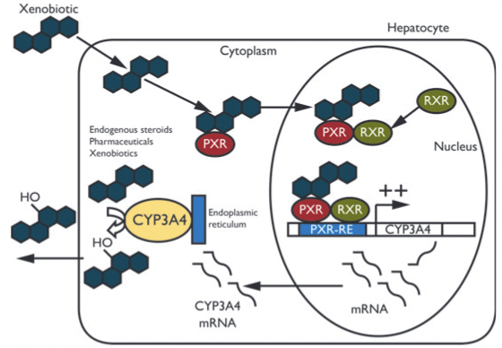
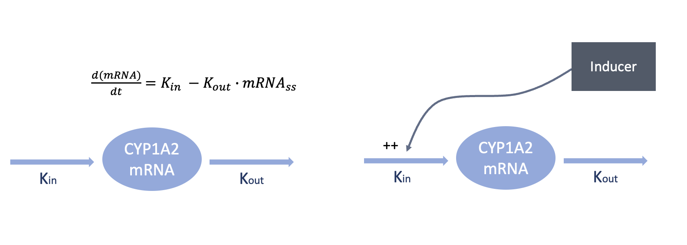
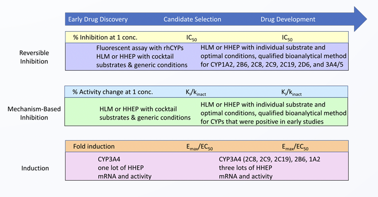
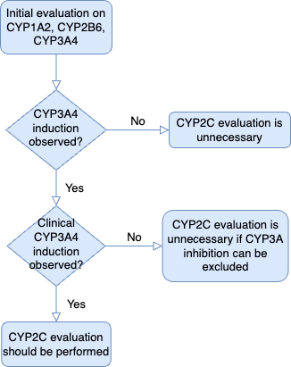
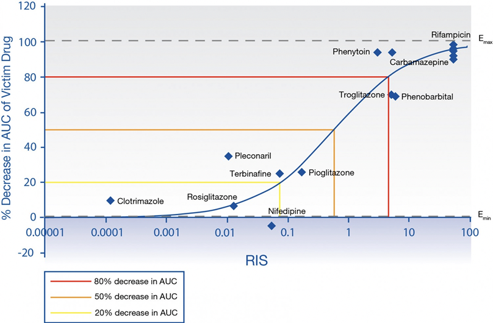

# 후보 물질의 대사 유도 특성 평가 {#Induction}

\Large\hfill

최수인

\normalsize

```{r include=FALSE}
library(knitr)
library(tidyverse)
opts_chunk$set(echo=FALSE)
```

## 서론

이 장에서는 개발하는 약물이 대사 유도체(Inducer)로써 작용할 가능성을 확인하고, 해당 유도 수준을 평가하는 다양한 방법을 살펴보기로 한다. 
유도 작용은 활성 대사 효소의 양을 변화 시켜 병용 약물의 노출 수준에 영향을 줄 수 있기 때문에 약물 개발에 있어서 개발하고 있는 후보 물질이 
이러한 유도제로써의 가능성이 있는지를 평가하는 것은 매우 중요하다. 특히 유도체는 다른 약물 상호작용에 비해 예측하기 어렵고 최대 효과가 
나타나는 대에 긴 시간이 걸리며, 약물을 중단한 후에도 당분간 유지되는 특성이 있어 약물 개발에 있어서는 후보 물질이 유도제 가능성이 
있는 것은 비교적 선호되지 않는 특성이며 반드시 확인해야 되는 사항이다.
대사 억제와는 다르게 유도제에 대한 정량적 평가 및 예측은 상대적으로 어렵기 때문에 대부분의 경우 후보 물질의 유도제로써의 가능성을 평가하는 것이
주된 목적이며, 이를 위한 다양한 induction assay 및 실험들을 수행하여 적절한 파라미터를 얻고 평가한다. 
이 장에서는 후보 물질의 유도제로써의 가능성을 평가하는 방법과 평가 결과를 해석하는 방법에 대해서 살펴보기로 한다.

## 유도 작용

대사 유도(Metabolic induction)란 주로 약이나 화학물질에 의해서 효소의 활성 수준이 증가하여 대사 능력이 증가하는 현상을 말하며, 
약동학적 약물상호작용 측면에서는 대사 효소의 양이 많아져서 기질의 청소율이 증가하는 것을 의미한다. 또한, 유도체(inducer)란 이러한 방식으로 
특성 효소를 유도할 수 있는 능력이 있는 물질을 의미한다. 유도 작용은 주로 핵 내 수용체 결합에 의해 유전자 발현을 조절하는 방식으로 일어나며 
동물 간 리간드 결합 도메인의 차이가 있기 때문에 동물 실험의 결과로 인간에서의 결과를 예측하기 어렵다. 
또한, 유전자 발현 조절을 통해 효소의 양을 증가시키는 방식이기 때문에 유도 작용은 다른 약물 상호작용에 비해 최대 효과가 나타나는 데에 시간이 걸리며 
(7일 이상), 약물을 중단한 후에도 당분간 유지되는 특성이 있다.

대사 유도는 1) 약물의 노출을 감소 시켜 약물의 효과를 감소시킬 수 있고 (Efficacy 감소) 2) 독성이 있는 대사체를 생성하는 경우에는 독성을 증가시킬 수
있으며 (Safety 감소) 3) Prodrug의 대사를 증가시켜 약물의 노출을 증가시켜 독성을 증가 시킬 수 있기 때문에 (Safety 감소) 다양한 관점에서 주의해서
접근해야 한다.

## 유도체의 작용 메커니즘

```{r mechanism, fig.cap = "(ref:mechanism)", echo = FALSE}

```

(ref:mechanism) 유도체의 작용 메커니즘

일반적으로 유도체는 위 그림\@ref(fig:mechanism)과 같이 1)세포 내로 들어가 특정 수용체, 주로 Nucleus receptor와의 결합을 통해 유전자의 발현을 
조절하여 효소의 생성을 증가 시키거나 2) 효소 혹은 mRNA의 안정성(Stability)을 증가시켜 제거되는 효소의 양을 감소시키는 방식 (e.g., CYP2E1)으로
 작용하게 된다. 이 중 대부분의 경우 1)의 형태를 띄며 유전자의 발현을 통해 조절하기 때문에 하나의 매커니즘을 통해 여러 종류의 효소를 유도할 수 있으며, 
 동일한 효소가 서로 다른 매커니즘을 통해 유도될 수 있는 특징을 가지고 있다. 따라서, 유도체의 작용 메커니즘을 이해하는 것은 유도체의 특성을 이해하는데 
 중요한 요소이다.


유도체의 작용 메커니즘은 다음과 같이 나눌 수 있다.

| **유도 메커니즘**                                           | **주요 대사 효소**                                    | **특징**                                                                                                                                                                 |
|------------------|------------------|------------------------------------|
| **PXR (Pregnane X receptor)**                               | CYP1A2, CYP2B6, CYP2C8/9/19, CYP3A4/5, UGT1A1/3/4/6/9 | CYP3A4, CYP2B6, CYP2Cs와 같은 주요 효소들이 관여 하며 직접적인 Ligand binding에만 의해서 활성화 되기 때문에 high throughput assay에서 가장 흔하게 사용되는 메커니즘이다. |
| **CAR (Constitutive androstane receptor) mediated control** | CYP2B6, CYP2C9/19, CYP3A4, UGT1A1, UGT2B1             | 직접적인 Ligand binding이 없이도 Translocation이 가능해서 다양한 형태로 활성화가 나타날 수 있으며 Expression의 사람 간 차이가 크다                                       |
| **AhR (Aryl hydrocarbon receptor) mediated control**        | CYP1A1/2, CYP1B1, UGT1A1/6                            | 직접적인 binding 없이 활성화 될 수 있으며 장기의 발생에 관련되어 상대적으로 Ubiquitous 한 특징을 가진다.                                                                 |
| **Enzyme stabilization**                                    | CYP2E1                                                | mRNA 발현과 무관하게 Proteosome 으로부터의 보호를 통해 활성 효소가 증가함                                                                                                |


### 특징

유도체는 주로 Receptor와의 결합을 통해 해당 효소의 유전자의 전사를 증가시키는 형태로 작용하기 때문에 전사 이후 효소 단백질이 만들어지기 까지는
일련의 과정을 거쳐야 한다. 따라서 유도체로 인해 효소 단백질이 실제로 증가되는 과정은 평형에 도달하기 까지에는 유도체 및 효소 단백질에 따라 짧게는 
며칠, 길게는 몇주까지로 매우 느리다. 또한 유전자의 발현을 조절하기 때문에 유도 작용 외에도 Carcinogenesis와 같은 다른 잠재적인 변화가 드물게 
나타날 수 있다. 유도체의 작용은 가역적으로 대부분 원래의 수준으로 돌아오나 해당 과정은 비교적 천천히 진행된다. 


### 유도체에 의한 활성효소의 변화

효소 및 mRNA는 평소에는 체내에서 평형을 이루고 있으며 아래 그림과 같이 일정한 생성속도(K~in~)와 제거속도(K~out~)에 의해 결정되는 
turnover model을 따른다(그림 \@ref(fig:turnover)). Turnover model을 표현한 식은 아래 식\@ref(eq:eq10-1)과 같으며 
유도체가 없는 상황에서는 생성속도($R{syn}$)와 제거속도($k{deg} /cdot Enz{(0)}$)가 동일한 동적 평형 상태($\frac{dEnz(t)}{dt}$)를 이룬다. 
이때 농도는 평형상태의 농도($Enz{ss}$)로 유지한다.


```{r turnover, fig.cap = "(ref:turnover)", echo = FALSE}

```

(ref:turnover) 체내의 효소가 따르는 Turnover 모델의 형태


```{=tex}
\begin{equation}
\frac{dEnz(t)}{dt} = R{syn} - k{deg} \cdot Enz(t)
(\#eq:eq06-1) 
\end{equation}
```


유도체는 위 그림의 오른쪽과 같이 수용체와의 결합을 통해 효소 mRNA의 전사속도를 증가시키기 때문에 해당 식의 생성속도(R~syn~)를 증가시키는 것으로 볼 수 있다. 
이러한 생성속도의 증가 정도는 유도체의 유도 능력(E~50~, E~max~)과 농도에 영향을 받게 되기 때문에 일반적으로 아래의 식\@ref(eq:eq10-2)과 같이 유도로 인한 생성속도의 증가를 표현한다.

```{=tex}
\begin{equation}
\frac{dEnz(t)}{dt} = R{syn} \cdot (1 + \frac{E{max}C(t)}{EC{50} + C(t)}) - k{deg} \cdot Enz(t)
(\#eq:eq06-2)
\end{equation}
```
단, 예외적으로 CYP2E1의 경우, 유도체는 효소의 안정화를 일으키므로 제거속도(k~deg~)를 감소시키는 방향으로 작용한다.


실제로 유도체는 전사체의 생성속도를 증가시키는 방향으로 작용하나, 전사체의 반감기 및 평형 상태의 농도와 같은 상수 값은 정량적으로 알기 어렵기 때문에 해당 식에 대한 해석이 어려워
유도체가 효소의 생성 속도를 동일한 메카니즘으로 증가시킨다는 가정하에 유도체의 작용에 대한 활성 효소의 시간에 따른 변화량을 표현하여 해당 수식을 사용한다. 

<!-- 생성속도를 증가시키는 경우 turnover model의 특성상 새로운 동적 평형에 도달하는 대에 걸리는 시간은 k~deg~에 의해 결정되며 이러한 k~deg~값은 효소의 종류에 따라서 다르다.  -->


## 후보 물질의 유도 가능 여부 평가를 위한 In vitro study 디자인

후보 물질의 유도체로써의 작용 가능성과 작용 정도에 대한 평가는 대부분 해당 물질의 개발 과정에 따라 다르게 이루어진다.

```{r assay, fig.cap = "(ref:assay)", echo = FALSE}

```

(ref:assay) 물질의 개발 단계에 따른 assay와 평가 변수

초기 개발 단계의 경우 스크리닝 수준에서의 assay가 이뤄지며 주로 96-well plated HHEP 방법이 사용된다. 이 방법은 물질의 구체적인 약동학 정보가 나오기 전에 유도체로서의 가능성 정도를 타진해 보고자 수행되기 때문에 
3\~4가지의 농도로 2\~3일 정도 처리해서 mRNA 또는 enzyme의 fold change 정도를 확인한다.
 CYP3A4는 CYP2C9 및 CYP2B6와 작용하는 수용체와 메커니즘이 유사하기 때문에 스크리닝 단계에서는 주로 CYP3A4 에 대해서만 시험하게 된다.

후보 물질의 개발 단계가 진행되면서 유도체로써의 작용에 대한 세밀한 평가가 이루어지게 된다. 이 경우는 3명 이상의 사람 간세포를 주로 이용하며 음성 대조군과 양성 대조군이 모두 사용된다. 유도체의 경우 실험 Variability가 큰 특징이 있어 
양성 대조군이 필수적으로 요구 되므로 아래와 같이 평가되는 효소에 따라 적절한 양성 대조군을 사용한다.

1.  CYP1A2 : Omeprazole
2.  CYP2B6 : Phenobarbital
3.  CYP2C9, CYP3A4 : Rifampin

이 단계에서 주로 RT-PCR을 이용하여 vehicle control 대비 증가한 mRNA의 fold change 크기를 통해 유도 능력을 평가하며 아래 그림과 같은 response curve를 구하여 Emax, EC50 값을 구한다. 
이때, 양성 대조군으로 사용된 약물의 알려진 Emax, EC50의 값을 assay에서의 값과 비교하여 실험 조건을 적절성을 확인하는 것이 중요하다.
mRNA가 아닌 활성화된 효소의 fold change의 경우 약물의 억제 작용이 혼재되어 나타날 수 있기 때문에 잘 선호되지 않으나 CYP1E2에 대한 유도 가능성이 있는 경우 효소의 안정화를 확인해야 하기 때문에 enzyme을 측정하게 된다. 
유도체의 경우 주로 3일 이상 관찰하며 사용하는 농도는 약물의 용해도, 간세포에 대한 독성과 약동학 정보를 모두 고려하여 결정한게 된다. 
특히 인체 약동학 정보가 있는 경우, 예측되는 인체 내 최대 노출 정도 (C~max,u~)에 대한 30\~50배 값을 이용할 것을 권한다. 유도체에 대한 시험이 끝나면 세포 독성을 확인하게 되며 만약 3일 이상 세포가 살아있지 않으면 관찰 기간을 축소하거나 
조금 더 낮은 농도를 사용하게 된다. 집단 내에서 CYP 발현 정도와 반감기 등은 사람간 차이가 있기 때문에 유도 결과 역시 donor에 따라 다르게 나타날 수 있으며 assay environment에 따라서도 다르게 나타난다.


## 후보 물질의 유도 가능성 평가

```{r diagram, fig.cap = "(ref:diagram)", echo = FALSE}

```

(ref:diagram) 후보 물질의 유도 가능성 평가를 위한 전략

주로 작용하는 Nuclear receptor 및 매커니즘에 따라 CYP1A2(AhR), CYP2B6(CAR), CYP3A4(PXR)에 대해서 우선적으로 평가하게 된다. 특히 CYP3A4와 CYP2C의 경우 모두 PXR에 의해 유도되기 때문에 위의 그림에서 처럼 CYP3A4의 
평가 결과가 음성인 경우 CYP2C의 평가는 생략할 수 있다. 그러나 CYP3A4 유도 실험 결과가 양성이라면 in vitro 혹은 in vivo 를 통한 CYP2C 유도 가능성 평가가 필요하다. CYP1A2의 경우 AhR에 의해, CYP2B6의 경우 CAR에 의해 
유도되기 때문에 CYP3A4의 평가 결과와는 관계없이 별도로 평가해야 한다.

현재 CYP450 효소 유도를 평가하는 방법에는 크게 3가지가 있다. RT-PCR을 이용한 mRNA 측정, 효소 활성 측정 및 western blot이다. CYP450 효소 유도 평가 방법에 대해 FDA에서는 2006년 가이던스 에서 효소활성측정법을 최적화된 평가법으로 제시하였으나 2012년 가이던스에서는 mRNA를 이용한 RT-PCR을 추천하는 수정안을 제시하였으며 현재까지 유도 가능성 평가에는 CYP1E2와 같이 효소의 안정화에 의한 경우를 제외하고는 mRNA 측정을 통한 평가를 진행할 것을 권고하고 있다. In vitro 시험에서 효소 유도 연구에 대한 실험 프로토콜은 상대적으로 표준화 되어 있지 않으며 실험실 및 기업마다 매우 다양하다. 또한 배양 간세포의 표현형 및 유도 반응을 변화시키기 위한 배양 형태, 배양 기간 및 배양액 보충물질(media suppiements)등과 
같은 실험 조건이 연구 결과에 미치는 영향이 큰 것으로 비교적 알려져 있다. 따라서 유도 가능성 평가 및 in vivo 예측력 관점에서 in vitro 연구에서 적절한 배양 형태 및 조건을 선택하는 것 뿐만 아니라 평가 시에 
음성 대조군과 양성 대조군을 통해서 적절히 Calibration해서 판단하는 것이 중요하다.

실험에 사용한 적어도 3명의 간세포 중 단 1명 이상의 간세포로부터 얻은 결과에서 아래의 평가 기준에서 기준치를 초과하는 경우에는 해당 시험 약물은 유도제로서의 가능성이 있는것으로 판단할 수 있으며 
이를 위한 후속 평가를 계획하고 수행해야 한다.


### Fold-change method

후보 약물을 넣었을 때 각 CYP Enzyme mRNA의 증가 수준(fold-change)을 확인하여 음성 대조군 및 양성 대조군을 통해 설정된 cut-off를 이용해서 유도 가능성을 평가할 수 있다. 일반적으로는 mRNA의 발현이 적절한 수준의 농도에서 음성 대조군에 비해 2배 이상 증가하는 경우 양성으로 판단한다. 여기서 적절한 수준의 농도란 예상되는 간에서의 농도를 주로 의미하며 이는 in vivo에서의 항정상태의 최대 혈장 농도(Imax,u)에 일정 배수 (e.g. 30배)를 곱한 값을 사용한다. 단, 실험 조건이 아직 정형화 되지 않았으며 이것이 연구 결과에 영향을 미치는 경우가 많은 점을 고려하여 음성대조군에 비해 mRNA가 2배 이내로 증가하더라도 양성 대조군의 반응과 비교하여 20% 이상의 반응을 보이는 경우에는 양성일 가능성을 배제하지 않으며 추가적인 평가를 수행한다.


### Correlation methods

위의 Fold-change method와는 달리 in vivo에서의 수준을 예측하여 유도체 가능성을 확인하는 방법으로 Induction 실험을 통해 구한 EC50와 Emax값을 이용한 파라미터와 Clinical induction potential, 즉 기질의 AUC 변화량과의 Correlation을 통해 예측하는 방법이다. 해당 Correlation은 아래 그림과 같이 각 enzyme별로 이미 알려진 Inducer의 AUC 변화량과 해당 실험 조건에서의 EC50, Emax를 이용해서 구한 파라미터를 이용하여 구할 수 있다.

```{r correlation, fig.cap = "(ref:correlation)", echo = FALSE}

```

(ref:correlation) Correlation method 예시

이때 사용하는 두가지 파라미터를 사용할 수 있으며 하나는 RIS(Relative induction score)로 다음과 같이 표현되며

\begin{equation}
\RIS = frac{E{max} \cdot C{max,u}}{EC{50} + C{max,u}} 
(\#eq:eq06-3) 
\end{equation} 다른 하나는 ($\frac{I{max,u}}{EC{50}}$)를 사용한다. 해당 방법을 통해 예측한 AUC ratio가 설정된 수준 (0.8 이하) 보다 낮은 경우에는 in vivo에서 유도 가능성이 있다고 판단한다.


### Basic kinetic model

CYP450 효소 유도를 평가하는 방법 중 비교적 최신에 가장 정형화된 방법으로 Correlation methods와 마찬가지로 induction 실험을 통해 구한 EC50와 Emax를 사용하여 R3를 계산하여 기존에 설정한 수준 (0.8 이하) 보다 낮은 경우에는 in vivo에서 후보 물질이 유도 가능성이 있다고 판단하는 방법이다. R3는 다소 복잡한 식으로 아래와 같이 계산한다.

```{=tex}
\begin{equation}
\R{3} = frac{1}{1 + d \cdot \frac{E{max} \cdot I{max,u} \cdot 10}{EC{50} + 10 \cdot I{max,u}}} 
(\#eq:eq06-4) 
\end{equation}
```
여기서 d값은 scaling factor로 일반적으로는 1로 설정하나 실험 환경에 따라서 기존 결과를 반영한 값을 설정할 수 있다. 또한 R3의 cut-off 수준은 기존의 동일한 실험 조건에서의 다른 유도체 및 양성 대조군의 결과를 통해 설정할 수 있다.


## In vitro-in vivo extrapolation (IVIVE)

Induction 실험에서의 결과를 통해 in vivo에서의 결과를 정량적으로 예측할 수 있다. 이를 위해서는 Mechanistic static model을 사용하거나 PBPK model을 사용할 수 있다. Mechanistic static model을 사용하는 경우, 병용하는 약물의 각 Enzyme 별 대사 정도($F{m, enzyme}$)와 후보 물질의 해당 Enzyme에 대한 Induction 실험을 통해 얻은 파라미터(E~max~, EC~50~)를 사용하여 AUCR, 즉 AUC의 변화량을 계산하게 되며 해당 방법은 아래와 같다.

```{=tex}
\begin{equation}
\AUCR = frac{1}{(1 + d \cdot \frac{E{max} \cdot I{max,u,gut}}{EC{50} + I{max,u,gut}}) \cdot f{g} + (1 - f{g})} /cdot frac{1}{(1 + d \cdot \frac{E{max} \cdot I{max,u,hep}}{EC{50} + I{max,u,hep}}) \cdot f{m} + (1 - f{m})} 
(\#eq:eq06-5)
\end{equation}
```
해당 방법은 병용 약물의 대사 수준을 고려하며 후보 약물의 각 장기에서의 농도를 고려하기 때문에 기존의 Basic kinetic model보다 더 정확한 예측을 할 수 있다. 단, 시간에 따른 농도의 변화를 고려하고 있지 않고 가장 높은 시점의 농도를 사용하고 있기 때문에 약물 상호작용 수준이 과대 추정될 가능성이 있기 때문에 더 정확한 결과를 원하는 경우 PBPK modeling을 통해서 예측해 보는 것이 좋다.
