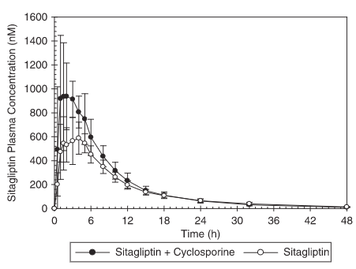
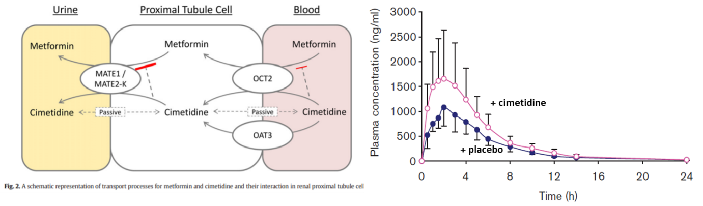
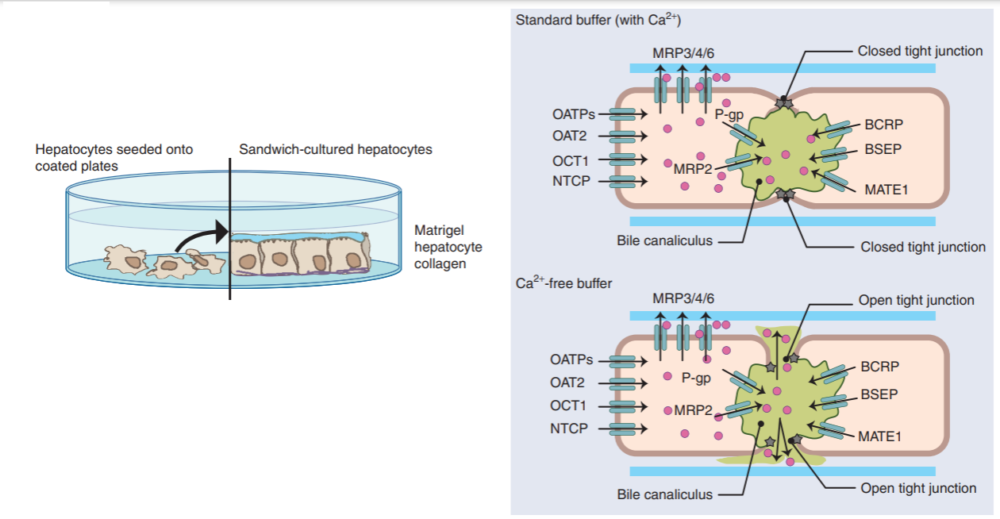

# 약물 수송체에 대한 후보물질의 작용평가

\Large\hfill
배수현
\normalsize

## 서론

세포내 물질 이동은 그림 \@ref(fig:07-01)과 같다. 
크게 수동수송과 능동수송으로 구분할 수 있다. 
수동수송은 세포막 사이의 물질의 농도 차이에 의해 발생한다. 
즉, 물질의 농도가 높은 곳에서 낮은 곳으로 농도 경사에 따라 이동하며, 에너지를 사용하지 않는다. 
비극성 물질은 단순확산(passive diffusion) 되며, 극성을 띄는 물질은 촉진 확산(facilitated diffusion)을 통해 세포막을 통과한다. 
반면, 능동수송은 물질이 농도에 역행하여 에너지를 써서 이동한다. 
낮은 농도에서 높은 농도로 물질이 이동하기 때문에 지속적으로 에너지를 사용하게 되며, 수송체를 통해 물질이 이동한다. 
수송체의 종류에 따라 Solute carrier (SLC) transporter와 ATP-binding cassette (ABC) transporter로 나뉜다. 
이 단원에서는 약물을 세포 내외로 이동시키는데 관여하는 수송체의 종류와 특성을 살펴보고, 신약후보물질의 수송체 기질 및 저해능 평가 방법에 대하여 기술한다.

```{r 07-01, fig.cap = "(ref:07-01)"}

```

(ref:07-01) 세포내 물질의 이동 원리

## 약물수송체의 종류와 역할

약물 수송체의 종류는 크게 SLC transporter와 ABC transporter로 나뉜다.
SLC 수송체는 주로 세포내로 물질을 수송(uptake)시키며, 나트륨(Na^+^) 등의
매개물질을 이용하여 물질을 함께 이동시키기도 한다. 이 경우, 매개물질이
농도 경사에 역행하여 에너지를 사용하며 이와 함께 물질이 이동하게 되므로
2차 수송이라고도 하며, 이온과 같은 방향으로 물질이 이동하는
경우(symport)와 다른 방향으로 물질이 이동하는 경우(antiport)가 있다.
전하를 띄고, 친수성 물질, 분자량이 작을수록 SLC 수송체의 기질일 가능성이
높다.

ABC 수송체는 SLC 수송체와 반대로, 주로 물질을 세포 밖으로(efflux) 내보내는데, 물질이 직접 농도 경사에 역행하여 수송되면서 ATP를
사용한다. 기질은 분자량이 상대적으로 크며, 지용성 물질 등인 경우가 많다.

다양한 종류의 수송체가 세포 표면에 분포하고 있으며, 이 중 약물의 ADME에
영향을 주는 수송체의 종류는 표 \@ref(tab:transporter)에 정리되어 있다.

(ref:transporter) 약물 수송체의 종류

```{r transporter}
read_csv('data-raw/transporter.csv', col_types="ccccc") %>% 
  kable(booktabs=TRUE, escape=FALSE, caption = "(ref:transporter)")
```

그림 \@ref(fig:07-02)에서와 같이 약물 수송체는 생체 내 여러 조직에 분포하고 있으며,
약물의 ADME에 영향을 미친다. 수송체 중에서 breast cancer resistant
protein (BCRP), P-glycoprotein (P-gp), multidrug resistance-related
protein 2 (MRP2)는 대표적인 efflux 수송체이며, 소장에서
장세포(enterocyte)로 들어온 약물을 다시 장 내강으로 되돌려 보냄으로써 약물의 흡수를
방해하며, 뇌에서는 뇌 모세혈관 내피세포로 들어온 약물을 혈액 속으로 돌려 보내어, 뇌에서 작용하는 약물의 약효를 떨어뜨리는 중요한 역할을 하기도
한다. Organic anion transporting polypeptide 1B1 (OATP1B1), OATP1B3,
OATP2B1 등은 대표적인 uptake 수송체이며, 주로 간에서 물질을 간세포 내로
수송시킨다. 고지혈 치료제인 HMG-CoA reductase 저해제 약물군이 OATP
수송체의 기질로 알려져 있으며, 이는 약물의 흡수 및 대사에 영향을 미칠 수
있다. 또한, 신장에 발현되어 있는 SLC 수송체들은 신장으로 배설되는 약물
및 대사체들의 소변 배설에 중요한 역할을 한다. 약물의 ADME에 중요한
역할을 하는 대표적인 수송체들에 대하여 자세히 살펴보자.

```{r 07-02, fig.cap = "(ref:07-02)"}

```

(ref:07-02) 생체 내 조직에 분포하는 수송체의 종류 [@brouwer2013vitro]

### MDR1과 BCRP

Efflux 수송체인 MDR1 (P-gp)와 BCRP는 위장관, 간, 신장 등을 포함한 다양한
조직에 분포하고 있다. 약물의 조직분포, 간과 신장으로의 배설 뿐만
아니라, 경구 투여하는 약물의 경우, 수송체의 기질 여부는 약물의 조직분포,
간 및 신장으로의 배설 뿐만 아니라, 생체이용률에 영향을 미친다. 특히,
소장에 발현되어 있는 MDR1와 BCRP는 약물을 장 상피에서
내강쪽으로 되돌려 보내 약물의 흡수를 감소시킨다. 이러한 수송체 기질약물의
경우, 1) 고용량 복용 시, 위장관에서의 약물농도 증가로 인해 수송체가
포화되거나 2) P-gp와 BCRP 저해제와 함께 복용하여 수송체로 efflux되는
부분이 줄어들어, 궁극적으로 혈중농도가 증가할 수 있다. 또한, P-gp의 기질
약물인 경우 CYP3A4의 기질 가능성이 높다고 알려져 있다. 그러므로
이 약물의 경우, 수송체에 의한 약물의 흡수 뿐만 아니라, 위장관과
간에 존재하는 CYP3A4에 의해 대사도 고려하여야 한다.

한편, 암세포의 약 50%는 MDR1이 과발현되어 있는 것으로 알려져 있으며,
이로 인하여 MDR1의 기질인 항암제의 경우, 내성이 나타나기도 한다.

혈액뇌관문 (blood-brain barrier, BBB)에 발현되어 있는 efflux 수송체는
뇌의 모세혈관 내피세포에 위치한 MDR1과 BCRP 수송체 등이다.
중추신경계 등 뇌에 작용하여 효과를 나타내는 약물 중에서 MDR1 또는 BCRP의
기질인 경우, 약물이 혈액뇌관문을 통과하여 세포 내로 들어가더라도
수송체에 의해 다시 세포 밖으로 돌려보내질 수 있다. 이런 경우, in vitro
시험에서는 낮은 농도에서 약효를 보였지만, in vivo에서는 표적조직(뇌)에서의
약물 농도가 높게 유지되지 않아 충분한 약효를 나타내지 못할 수 있다.

### OATP

OATPs 수송체는 세포내로 물질을 uptake 시킨다. 약물의 약동학에 영향을
미치는 중요한 OATP는 간세포의 sinusoidal membrane에 발현되어 있는
OATP1B1, OATP1B3, OATP2B1이며, 약물을 간세포 내로 uptake시켜, 약물의
대사 및 배설에 중요한 역할을 한다 (그림 \@ref(fig:07-03)). 또한, OATP1B1은 유전적
다형성(genetic polymorphism)을 나타낸다. OATP1B1의 기질로 알려져 있는
HMG-CoA reductase 저해제의 경우를 살펴보자. OATP1B1 \*15 allele를 가진
대상자의 경우 wild-type인 \*1a 또는 \*1b allele를 가진 경우보다
pravastatin과 rosuvastatin의 AUC가 각각 85%, 252% 증가하였다 (Nishizato
et al. 2003; Lee et al. 2005). 이러한 수송체의 유전적 다형성으로 인해
간으로의 유입에 차이가 생기게 되어 약물의 대사 및 배설에 영향을 미치며,
결국 개인간 약물의 혈중노출이 달라질 수 있다.

```{r 07-03, fig.cap = "(ref:07-03)"}

```

(ref:07-03) 간세포에 발현되어 있는 수송체들

### MRP

MRP 수송체는 물질을 세포밖으로 efflux 시키는 수송체이며, 소장, 간,
신장에 분포하고 있다. 이중에서도 MRP2는 장 상피의 내강쪽 세포막에 위치하여, 
장세포 내의 약물을 내강으로 돌려보낸다. 또한, 간에서
MRP2는 canalicular membrane에 위치하여, 약물의 담즙 배설에 중요한 역할을
하며, MRP3, MRP4는 sinusoidal membrane에 존재한다. 포합담즙산
(conjugated bile acids)은 MPR의 기질로 알려져 있으며, 담즙산은 MRP2를
통해 담즙 배설되거나, MRP3 또는 MRP4를 통해 혈중으로 이동한다.
빌리루빈의 경우 또한, MRP2를 통해 배설되므로, MRP2를 저해하는 약물을
복용할 경우, 고빌리루빈혈증(hyperbilirubinemia)이 나타날 수 있으므로,
주의해야 한다. 약물에 glucuronic acid나 glutathione이 통합되어
대사되면, 이는 MRP 수송체의 기질이거나 저해제 일 수 있으므로, in vitro
실험을 통해 확인하는 것이 좋다.

신장에는 근위세뇨관의 brush-border (apical) membrane에 MRP2가 발현되어
있으며, 이는 약물을 소변으로 배설시키는 역할을 한다.

### BSEP

Bile salt export pump (BSEP) 수송체는 이름에서도 알 수 있듯이 간세포의
canalicular membrane에 위치하여 담즙산을 담즙으로 배설시키는
수송체이다(그림 7-3). 약물에 의하여 BSEP이 저해되면, 담즙배설이 원활하지
않으며, 빌리루빈의 배설 또한 저해할 수 있어, MRP2 저해와 마찬가지로
고빌리루빈혈증이 나타날 수 있으며, cholestatic liver disease등 과 같이,
drug-induced liver injury (DILI)를 일으킬 수 있다. 이러한 이유로,
European Medicine Agency (EMA) 및 International Transporter Consortium(ITC)에서
신약후보물질에 대한 in vitro BSEP 저해능 연구를 권고하고 있다. [@european2012guideline;@kenna2020sc1;@zamek2018transporters]

### MATE

Multidrug and toxin extrusion (MATE) 수송체는 주로 간의 canalicular
membrane (MATE1)과 신장 proximal tubule cells의 brush-border membrane
(MATE1, MATE2-K)에 존재하는 efflux 수송체이다 (그림 \@ref(fig:07-04)). 주로 양이온이나 zwitter 이온 물질을 수송시키며, 신장에서 약물을 배설시키는
역할을 한다.

```{r 07-04, fig.cap = "(ref:07-04)"}
knitr::include_graphics('media-07/image6.png')
```

(ref:07-04) 신장 proximal tubule cell에 발현되어 있는 수송체

## 수송체를 매개한 약물의 세포 내 분포

In vitro transporter assay를 통해 약물이 특정 수송체의 기질임을
확인하였더라도 약물의 세포 투과도가 빠르면, 수송체에 의한 약물의 세포
내로 이동이 중요하지 않을 수 있다. 반면에, 약물의 세포 투과도가 느리면,
수송체에 의한 약물의 세포 내외 이동이 더 중요한 요인이 될 수 있다.
약물의 대사와 배설이 일어나는 간세포에서는 수송체에 의한 능동 수송이
약물의 대사와 배설에 영향을 미칠 수 있다. 간 클리어런스는 아래의 식과
같이 나타낼 수 있다. 그림 \@ref(fig:07-05)의 경우를 통해 자세히 살펴보자. [@varma2015predicting]

\begin{equation}
{CL}_{int,organ} = \ \frac{({PS}_{\inf}\  + {PS}_{pd})}{{PS}_{\inf} + {PS}_{pd} + {CL}_{int,met} + {CL}_{int,exc}} \cdot {(CL}_{int,met} + {CL}_{int,exc})
(\#eq:eq07-00) 
\end{equation}

```{r 07-05, fig.cap = "(ref:07-05)"}
knitr::include_graphics('media-07/image7.png')
```

(ref:07-05) 간세포에의 약물의 이동 및 대사

### 세포 투과도가 큰 경우 (high passive permeability)

세포 투과도가 큰 경우, 세포 내외의 비결합 약물농도(C~u~)가 빠르게
평형에 도달한다. 즉, 세포 내의 약물의 대사 및 배설속도 보다 약물의
세포내 유입속도가 더 크면, 약물의 조직에서의
클리어런스(CL~int,organ~)는 대사 클리어런스(CL~int,met~)와 담즙으로
배설되는 클리어런스(CL~int,exc~)의 합이다. 아래 식에서 PS~inf~와
PS~eff~는 각각 능동 수송에 의한 세포 내 유입
클리어런스(transporter-media ted sinusoidal influx clearance)와 능동
수송에 의한 세포 외 유출 클리어런스(transporter-media ted sinusoidal
efflux clearance)를 의미하며, PS~pd~는 수동확산 클리어런스(passive
diffusion clearance)를 의미한다.

\begin{equation}
\begin{split}
C_{u,\ intracellular} &= \ C_{u,\ extracellular} \\
{CL}_{int,organ} &= \ {CL}_{int,met} + \ {CL}_{int,exc}
\end{split}
(\#eq:eq07-01) 
\end{equation}

### 세포 투과도가 작은 경우 (low passive permeability)

세포 투과도가 작은 경우, 약물의 능동수송으로 인한 세포 내외 이동이
약물의 조직에서의 클리어런스에 가장 큰 영향을 미칠 수 있다. 아래 식과
같이, 세포내외로 이동하는 속도가 세포내에서 약물의 대사 및 배설속도
보다 느리면, 간 클리어런스는 세포 내 약물의 능동수송 속도에 의하여
좌우된다.

\begin{equation}
\begin{split}
C_{u,\ intracellular} &\neq \ C_{u,\ extracellular} \\
{If,\ (CL}_{int,met} + \ {CL}_{int,exc}) &\gg \left( {PS}_{pd} + {PS}_{eff} \right)\ then, \\
{CL}_{int,organ} &= {PS}_{pd} + {PS}_{\inf}
\end{split}
(\#eq:eq07-02) 
\end{equation}

## 수송체를 매개한 약물상호작용의 예

수송체를 매개한 약물상호작용은 다양한 상황을 고려하여야 한다. 수송체를
통한 약물의 세포 내 외 물질 이동은 약물의 흡수, 분포, 대사, 및 배설에
영향을 미치며, 이로 인해 약물의 혈중농도 및 표적 조직에서의 농도
변화로 인하여 약물의 약효 및 안전성에 영향을 미칠 수 있다.

### Sitagliptin -- cyclosporin

Sitagliptin -- cyclosporin 경우는 수송체를 경유하는 일반적인
약물상호작용의 예이다. Sitagliptin 100 mg과 cyclosporin 600 mg을 단회
병용 투여하였을 때, sitagliptin의 C~max~와 AUC는 각각 1.68 배와 1.29 배
증가하였다(그림 \@ref(fig:07-06)) [@krishna2007effect]. Cyclosporin이 efflux 수송체인 MDR1을 저해하여,
sitagliptin의 위장관 흡수를 증가시켰으며, 동시에 cyclosporine이
위장간 및 간의 CYP3A4를 저해하여, sitagliptin의 대사를 저해시켰으므로, sitagliptin의 혈중 노출이 증가하였다.
이처럼 수송체를 매개하는 약물상호작용은 직접적인 수송체 저해에 의한
영향 뿐만 아니라, 약물 수송 이후의 대사 및 배설 과정에 간접적으로 영향을
미칠 수 있기 때문에, 대사과정에 의한 약물상호작용 보다 더 복잡하다.


```{r 07-06, fig.cap = "(ref:07-06)"}

```

(ref:07-06)   Sitagliptin과 cyclosporine의 약물상호작용 [@krishna2007effect]

### Fimasartan -- ketoconazole/rifampicin

앞선 sitagliptin -- cyclosporin 보다 복잡한 케이스이다. Fimasartan은
OATP1B1/1B3를 통해 세포내로 유입되고, CYP3A4를 통해 대사된다. CYP3A4의
강력한 저해제인 ketoconazole과 유도제인 rifampicin과 fimasartan의
약물상호작용 평가 임상시험 결과가 보고되어 있다 [@kim2013increased].
항정상태의 ketoconazole과 rifampicin에 fimasartan 240 mg을 단회 병용
투여하였을 때, ketoconazole은 fimasartan의 C~max~ 와 AUC를 각각 2.47배 2.03배 증가시켰으며, rifampicin은 fimasartan의 C~max~ 와 AUC를 각각
10.33배 와 4.60배 증가시켰다. (그림 \@ref(fig:07-07) Rifampicin의 경우, 강력한 CYP3A4 유도제로
알려져 있지만, OATP1B1의 저해제이기도 하다. 즉, rifampicin은 간에
존재하는 OATP1B1을 저해하여, fimasartan의 간으로의 유입을 억제하였으며,
이로 인해 fimasartan의 초회통과 효과 및 간대사를 최소화하여 C~max~를
대략 10배 이상 증가시켰다. 이러한 저해작용에 CYP3A4 유도효과가 더해져,
AUC의 증가율은 C~max~의 증가율 보다 낮았다. 특히 rifampicin과 병용 시
fimasartan의 t~1/2~가 0.26배 작아진 것으로 보아(그림 \@ref(fig:fig2table-fima)) OATP1B1의
저해능과 CYP3A4의 유도능이 복합적으로 작용하였지만 결국 fimasartan의
혈중 노출을 증가시켰다.

```{r 07-07, fig.cap = "(ref:07-07)"}

```

(ref:07-07) Fimasartan과 ketoconazole/rifampicin의 약물상호작용 [@kim2013increased]

```{r fig2table-fima, fig.cap = "(ref:fig2table-fima)"}

```

(ref:fig2table-fima) Fimasartan과 ketoconazole/rifampicin의 약물상호작용 [@kim2013increased]

### Cerivastatin -- gemfibrozil

Cerivastatin은 부작용으로 치명적인 횡문근융해증 발병이 보고되어 2001년
자발적으로 시장에서 철수하여, 현재는 판매되고 있지 않은 약물이다.
하지만, cerivastatin -- gemfibrozil의 약물상호작용은 수송체 및
대사효소를 매개한 복잡한 기전으로 잘 알려져 있는 케이스이므로 간략하게
소개하도록 한다. Gemfibrozil과 그 대사체 gemfibrozil-glucuronide는
OTAP1B1의 저해제이며, 동시에 간에서 CYP2C8을 저해한다. 특히,
gemfibrozil-glucuronide는 CYP2C8를 비가역적으로 저해하는 것으로 알려져
있다 [@ogilvie2006glucuronidation]. Cerivastatin은 OATP1B1의 기질이며,
CYP2C8(61%)과 CYP3A4(37%)로 대사된다. Gemfibrozil과 함께 복용 시,
gemfibrozil 및 gemfibrozil-glucuronide의 OATP1B1과 CYP2C8 저해능으로
인해, cerivastatin의 C~max~와 AUC는 각각 2.5배와 4.36배
증가하였다[@backman2002gemfibrozil]. (그림 \@ref(fig:07-08))

```{r 07-08, fig.cap = "(ref:07-08)"}

```

(ref:07-08)  Cerivastatin-gemfibrozil 약물상호작용. Cerivastatin의 gemfibrozil 병용에 따른 혈중농도 프로파일 변화(좌)와 cerivastatin-gemfibrozil 약물상호작용 기전 (우) [@backman2002gemfibrozil]

### Metformin -- cimetidine

Metformin -- cimetidine의 약물상호작용의 예를 살펴보자. 임상적으로
보고되어 있는 ADME와 관련된 약물상호작용은 위장관과 간에 존재하는 수송체
및 대사효소에 의한 것이 대부분이지만, metformin -- cimetidine의
약물상호작용은 신장에 존재하는 수송체를 매개한다. Cimetidine은 신장에서
metformin의 배설에 관여하는 OCT2와 MATE1/2-K를 저해하여, metformin의
소변으로의 배설을 감소시켰다[@burt2016metformin]. 그 결과, metformin의
C~max~와 AUC는 cimetidine과 병용 시 각각 1.5배와 1.6배 증가하였다. [@wang2008oct2] (그림 \@ref(fig:07-09))

```{r 07-09, fig.cap = "(ref:07-09)"}

```

(ref:07-09) Metformin -- cimetidine 약물상호작용. Metformin -- cimetidine의 신장에서의 약물상호작용 기전 [@burt2016metformin] (좌)와 metformin의 cimetidine 병용에 따른 혈중농도 프로파일 변화 [@wang2008oct2]  (우)

## In vitro 수송체 평가 방법

In vitro에서 약물의 수송체 기질 및 저해능 평가 방법은 다양하다.
대사효소와 관련된 in vitro 평가방법과 달리, 허가기관에서 제시하는
전형적인 방법이나 gold standard 방법이 정해져 있지 않기 때문에, 물질의
특성과 상황에 맞는 방법을 사용하면 된다. 다양한 방법들 중에 많이
사용되는 실험계는 vesicle systems, 수송체를 형질주입하여 과발현한
세포주(transfected cell lines), 그리고 간세포이다. 각각의 실험계를
이용한 평가법의 특성과 평가 방법, 장단점에 대하여 알아보자.

### Vesicular assays

Vesicular assays는 ATP를 사용하는 ABC 수송체 평가법에 사용되기 때문에,
ATPase assay라고도 한다. Efflux 수송체의 기질 여부를 평가하기 위해서는
평가약물이 우선 세포 내로 유입된 후에 세포 밖으로 퍼내어지는 것을
평가하여야 하는데, 특히, 세포막 투과도가 낮은 약물의 경우에는 세포내로
uptake 되는 속도가 약물의 세포 외 이동 속도를 좌우할 수 있기 때문에,
whole-cell system을 사용한 efflux 수송체의 기질평가는 적절하지 않을 수
있다. 이러한 경우에 vesicular assay를 사용할 수 있다. 그림 \@ref(fig:07-10)에서와
같이, ABC 수송체가 발현되어 있는 세포에서 원형질막을 분리하면
정방향(right-side-out) 또는 뒤집힌 방향(inside-out)의 membrane
vesicles이 만들어진다. 이 중에서 inside-out membrane vesicle만이 ATP와
반응하여 vehicle 내로 물질을 이동시킬 수 있다. Inside-out vesicle은
뒤집혀 있는 형태로 ABC(efflux) 수송체의 방향과 물질 이동 방향이
세포막에 존재하는 수송체와 반대로 위치하기 때문에, vesicle 외부에
존재하는 물질이 ATP를 이용하여 vesicle 내로 들어간다. 그렇기 때문에,
세포 내로 물질이 이동하는 속도가 efflux 수송체의 기질성 평가에 영향을
미치지 않는다. 또한, 살아있는 세포주가 아니기 때문에, 세포독성을
고려하지 않아도 되며, intact cell system을 이용한 수송체 평가 실험보다
적은 양의 세포로 실험이 가능하다. 앞서 말한바와 같이, 주로 ABC(efflux)
수송체의 기질성 평가에 활용되며, 상업적으로 판매하는 vesicle이 있기
때문에, 비교적 편리하게 활용될 수 있다.

```{r 07-10, fig.cap = "(ref:07-10)"}
knitr::include_graphics('media-07/image13.png')
```

(ref:07-10) (Transfected) Cell lines

형질전환을 위해 사용가능한 세포주는 다양하지만, HEK293, LLC-PK1, MDCK,
CHO 세포주 등이 흔히 사용된다. HEK293과 CHO 세포는 내인성 수송체의
발현이 적고, 비교적 세포를 다루기 쉽기 때문에 uptake 수송체 과발현에
많이 사용된다. 반면, LLC-PK1과 MDCK 세포는 단단한 극성 세포 단층(tight
polarized cell monolayers)을 형성할 수 있기 때문에, efflux 수송체
과발현에 주로 사용된다. *Xenopus laevis*의 oocytes도 예전부터 많이
이용되어 왔지만, 포유동물 세포를 숙주로 사용하였을 때와 동일한 결과를
얻지 못했다는 연구결과도 보고되었기 때문에, 이를 염두해두고 사용하여야
한다. 또한, oocyte에서 얻어진 수송체 파라미터를 in vivo PK 예측에
활용(in vitro-in vivo extrapolation, IVIVE) 할 때에는 주의하여야 한다.

#### Uptake studies using recombinant cell lines

수송체 과발현 세포주를 이용한 uptake 실험은 시험물질 처리 후, incubation
시간을 10분 이내로 하는 것이 좋다. 과발현 되지 않은 세포주(wild-type
cells)에서의 결과와 비교하여, 과발현 세포주에서 시험물질의 세포 내
축척이 많으면, uptake 수송체에 의해 세포내로 물질이 이동되었으며, 이는
시험물질이 uptake 수송체의 기질임을 의미한다. 또한, 수송체 저해제를 함께
처리하여 시험물질의 세포내 이동을 확인하여, 수송체 기질성을 확인할 수
있다.

시험이 uptake 수송체의 저해제임을 확인하기 위해서는 잘 알려진
기질약물과 다양한 농도의 시험약물을 함께 처리하여, 시험약물의 농도에
따른 기질 약물의 세포 내 축척 변화량을 확인하여야 한다. 이 경우에도
시험약물 처리 후, incubation 시간을 10분 이내로 하여, 기질약물의 초기
uptake 속도를 측정하여야 한다.

#### Bidirectional transport systems

Efflux 수송체의 기질성을 평가할 때에는 극성 세포 단층(polarized cell
monolayers)을 이용한 양방향성 수송체 시험법(bidirectional transport
assays)을 주로 사용한다. 그림 \@ref(fig:07-11)에서처럼 양방향성 수송체 시스템은
apical (A) 부분과 basolateral (B) 부분이 있으며, 시험약물을 A 부분에
처리 후, A에서 B로 이동하는 약물의 이동속도를 확인하거나 (A-B
transport), 반대로 시험약물을 B부분에 처리 후, B에서 A로 이동하는 약물의
이동속도 확인 (B-A transport) 할 수 있다. 이러한 이동 속도를
투과도(apparent permeability, P~app~)라고 한다. 사용한 세포주 자체에
존재하고 있는 efflux 수송체 때문에 efflux 수송체의 기질 약물인 경우에
B-A/A-B 비가 차이날 수 있다. 일반적으로, B-A/A-B 비가 2 이상이면, 그
약물은 efflux 수송체의 기질로 간주된다. 이러한 경우, 대표적인 efflux
수송체인 P-gp 또는 BCRP 등의 저해제를 시험약물과 함께 처리하여, 수동
수송(passive transport)되는 시험 약물의 P~app~만 확인하거나, efflux
수송체가 과발현된 세포주를 이용하여, 수송체에 의해 능동 수송되는
P~app~를 확인할 수 있다. P~app~를 구하는 식은 아래와 같다.

\begin{equation}
\begin{split}
P_{app} = \ \frac{Volume\ of\ receptor\ chamber\ (mL)\ }{Membrane\ area\ ({cm}^{2}) \times \ {Concentration}_{initial}(\mu M)}\  \times \ \frac{\mathrm{\Delta}\ Concentration\ (\mu M)\ }{\mathrm{\Delta}\ time\ (s)}
\end{split}
(\#eq:eq07-03) 
\end{equation}

```{r 07-11, fig.cap = "(ref:07-11)"}

```

(ref:07-11) In vitro bidirectional transport system (좌)와 CaCO-2 세포 단층 (우)

시험에 사용될 수 있는 세포주는 대표적으로 CaCO-2, MDCKII, LLC-PK1 등이
있다. CaCO-2의 경우, 투과도 확인을 위한 세포 배양 기간이 최소 2\~3주로
긴 편이지만, 내인성 efflux 수송체가 많이 발현되어 있어, 약물의 efflux
수송체의 기질 여부를 간단히 확인할 수 있다. 반면에, MDCKII와 LLC-PK1은
세포 배양시간이 짧은 편(MDCKII: 3일, LLC-PK1: 4\~6일)이며, 내인성 efflux
수송체의 발현이 적으므로, efflux 수송체의 기질여부를 판단하기에 적절하지
않을 수 있다.

표 7.3은 CaCO-2 세포주를 통해 얻은 P~app~ 데이터의 예이다.
시험물질을 CaCO-2 세포단층에 처리하여 P~app~를 산출하였다. B-A/A-B
비는 22.4으로 시험물질을 efflux 수송체의 기질일 가능성이 매우 높다. P-gp
수송체 저해제인 Zosuquidar와 시험물질을 함께 처리하였을 때, B-A/A-B 비는
5.89로 감소하였지만, BCRP 수송체 저해제인 Ko143와 함께 처리하였을 때는
B-A/A-B 비가 시험물질만 처리했을 때와 거의 비슷하였다. 이 결과를 통해 시험물질은
efflux 수송체, 특히, P-gp 수송체의 기질일 가능성이 매우 높다.

```{r 07-12, fig.cap = "(ref:07-12)"}
knitr::include_graphics('media-07/image18.png')
```

(ref:07-12) CaCO-2 세포주를 이용한 P~app~ 산출 데이터의 예

### Sandwich-cultured hepatocytes

간세포를 그림 \@ref(fig:07-13)와 같이 콜라겐 층 사이에서 배양(sandwich-cultured
hepatocytes, SCH)시키게 되면, 간세포들이 시간이 흐름에 따라
polarization되고, canalicular system을 만들게 된다. 이러한 시스템이
만들어지는데에 사람 간세포의 경우 대략 6\~7일 정도의 배양 시간이
소요된다. SCH를 이용하면, 시험약물의 수동 확산에 의한 세포 이동 및 능동
수송에 의한 세포 내 uptake 뿐만 아니라, 담즙 배설 등을 확인할 수 있다.
시험물질의 세포 내 uptake 속도를 구하기 위해서는 시험물질을 SCH에
처리하자 마자, 대략 2분 이내의 짧은 시간에 세포내로 유입되는 속도를
측정하여야한다. 세포내로 약물의 유입 클리어런스는 다음과 같은 식으로
산출한다. 시험 약물 처리 후, 배양시간 동안 약물의 축척량(amount)의
변화량과 시간 차, 그리고 시험약물의 농도인 Concentration~medium~이
필요하다.

\begin{equation}
\begin{split}
{CL}_{uptake} = \ \frac{\mathrm{\Delta}\ Accumulation\ }{\mathrm{\Delta}\ time \times \ {Concentration}_{medium}}
\end{split}
(\#eq:eq07-04) 
\end{equation}

```{r 07-13, fig.cap = "(ref:07-13)"}

```

(ref:07-13) Sandwich-cultured hepatocytes (Brower et al., CTP (2013) 94:95-112)

또한, 칼슘과 마그네슘 이온이 포함되어 있지 않은 배양액을 사용하여 SCH를
incubation하면, 그림 7-12 (우)에서처럼, canalicular system의 tight
junction이 헐거워지게 된다. 그렇게 되면 담즙 배설된 시험 약물이 세포
배양액 쪽으로 흘러나오기 때문에, 칼슘과 마그네슘 이온이 포함되어 있는
배양액을 사용하여 실험한 결과와 비교하여, 담즙 배설된 약물의 양을 계산할
수 있다. 이 때의 수식은 아래와 같다. Accumulation~std~는 일반적으로
사용되는 배지에서의 약물의 축적량을 의미하며, Accumulation~Ca2+free~는
칼슘과 마그네슘 이온이 포함되어 있지 않은 배지에서의 약물의 축척량을
의미한다.

\begin{equation}
\begin{split}
{CL}_{bile,\ int} = \ \frac{{Accumulation}_{Std} - {Accumulation}_{{Ca}^{2 +}free}\ }{{AUC}_{cell}}
\end{split}
(\#eq:eq07-05) 
\end{equation}

## 맺음말

후보물질의 세포 내외의 이동은 수동 확산 또는 능동 수송을 통해
이루어지며, 다양한 실험방법을 통해 in vitro에서 P~app~를 비롯하여 수송
확산 및 능동 수송과 관련된 kinetic parameter를 얻을 수 있다. 위장관에
존재하는 수송체의 기질 여부는 약물의 흡수에 주로 영향을 미치며, 간과
신장등에 많이 존재하는 수송체의 기질 여부는 약물의 대사 및 배설에 영향을
미친다. In vitro에서 얻은 데이터는 in vivo로 외삽할 수 있으며, 이를
이용하여 수송체의 기질 및 저해능을 정량적으로 평가할 수 있다. 또한, 간
클리어런스를 구하는데 주로 사용되고 있는 well-stirred model은
perfusion-limited를 가정하고 있으므로 투과도가 낮으면서 수송체의 기질인
후보물질의 간 클리어런스 계산에는 적합하지 않을 수 있다. 이런 경우에는
수동확산 및 능동수송에 의한 세포 내외 이동을 반영한 아래와 같은 식을
이용하여 간 클리어런스를 구할 수 있다(Varma et al. 2017). 식 \@ref(eq:eq07-06)에서
CL~uptake~, CL~efflux~, CL~pd~, CL~int~는 각각 sinusoidal uptake
수송체에 의한 클리어런스, sinusoidal efflux 수송체에 의한 클리어런스,
수동확산 클리어런스, 대사 및 담즙배설 클리어런스를 의미하며, Q~h~, f~B~,
E~h~는 각각 간 혈류 속도, 혈액에서의 약물의 비결합분율, 및 extraction
ratio를 의미한다.

\begin{equation}
\begin{split}
{CL}_{int,h} = \ \frac{{(CL}_{uptake} + {CL}_{PD})\  \cdot \ {CL}_{int}}{{(CL}_{efflux} + {CL}_{PD} + {CL}_{int})} \\
{CL}_{h} = \ Q_{h} \cdot \frac{f_{B} \cdot {(CL}_{uptake} + {CL}_{PD})\  \cdot \ {CL}_{int}}{{Q_{h} \cdot (CL}_{efflux} + {CL}_{PD} + {CL}_{int}) + \ f_{B} \cdot {(CL}_{uptake} + {CL}_{PD})\  \cdot \ {CL}_{int}\ } = \ Q_{h} \cdot E_{h}
\end{split}
(\#eq:eq07-06) 
\end{equation}

신약개발 과정에서 약물의 수송체의 기질 및 저해성 여부를 평가하는 것은
약물의 약동학 및 더 나아가 병용약물과의 약물상호작용을 평가하는데 있어
필수적으로 필요한 자료이다. 특히, 개발 약물이 항암제이거나 약효를
나타내기 위해 혈액뇌관문을 통과해야 한다면 efflux 수송체의 기질 여부는 면밀히
평가해야 한다. 추후 임상 진행에서 PBPK 모델링을 통한 약물상호작용 평가
및 제형 변경 등에 의한 약동학 평가 예측에 다양하게 활용될 수 있기
때문에 후보물질의 수송체의 기질성 및 저해능을 확인하였다면 각 수송체에
대한 후보물질의 특성을 정량적으로 평가할 수 있는 kinetic parameter
(J~max~, K~m~, CL, CL~efflux~, CL~pd~ 등)들을 얻어야 함을 잊지 말자.

**참고문헌**

Backman, J. T., C. Kyrklund, M. Neuvonen, and P. J. Neuvonen. 2002.
\'Gemfibrozil greatly increases plasma concentrations of cerivastatin\',
*Clin Pharmacol Ther*, 72: 685-91.

Brouwer, K. L., D. Keppler, K. A. Hoffmaster, D. A. Bow, Y. Cheng, Y.
Lai, J. E. Palm, B. Stieger, R. Evers, and Consortium International
Transporter. 2013. \'In vitro methods to support transporter evaluation
in drug discovery and development\', *Clin Pharmacol Ther*, 94: 95-112.

Burt, H. J., S. Neuhoff, L. Almond, L. Gaohua, M. D. Harwood, M. Jamei,
A. Rostami-Hodjegan, G. T. Tucker, and K. Rowland-Yeo. 2016. \'Metformin
and cimetidine: Physiologically based pharmacokinetic modelling to
investigate transporter media-07ted drug-drug interactions\', *Eur J Pharm
Sci*, 88: 70-82.

International Transporter, Consortium, K. M. Giacomini, S. M. Huang, D.
J. Tweedie, L. Z. Benet, K. L. Brouwer, X. Chu, A. Dahlin, R. Evers, V.
Fischer, K. M. Hillgren, K. A. Hoffmaster, T. Ishikawa, D. Keppler, R.
B. Kim, C. A. Lee, M. Niemi, J. W. Polli, Y. Sugiyama, P. W. Swaan, J.
A. Ware, S. H. Wright, S. W. Yee, M. J. Zamek-Gliszczynski, and L.
Zhang. 2010. \'Membrane transporters in drug development\', *Nat Rev
Drug Discov*, 9: 215-36.

Kenna, Gerry. 2020. \'SC1. 4-Can BSEP inhibition testing in drug
discovery and development reduce liver injury risk? An international
transporter consortium perspective\', *Drug Metabolism and
Pharmacokinetics*, 35: S1-S2.

Kim, Jung Won, SoJeong Yi, Tae‐Eun Kim, Kyoung Soo Lim, Seo Hyun Yoon,
Joo‐Youn Cho, Min Goo Lee, Im‐Sook Song, Sang‐Goo Shin, and In‐Jin Jang.
2013. \'Increased systemic exposure of fimasartan, an angiotensin II
receptor antagonist, by ketoconazole and rifampicin\', *The Journal of
clinical pharmacology*, 53: 75-81.

Kim, S. J., K. Toshimoto, Y. Yao, T. Yoshikado, and Y. Sugiyama. 2017.
\'Quantitative Analysis of Complex Drug-Drug Interactions Between
  Repaglinide and Cyclosporin A/Gemfibrozil Using Physiologically Based
Pharmacokinetic Models With In Vitro Transporter/Enzyme Inhibition
Data\', *J Pharm Sci*, 106: 2715-26.

Krishna, Rajesh, Arthur Bergman, Patrick Larson, Josee Cote, Kenneth
Lasseter, Stacey Dilzer, Amy Wang, Wei Zeng, Li Chen, and John Wagner.
2007. \'Effect of a single cyclosporine dose on the single‐dose
pharmacokinetics of sitagliptin (MK‐0431), a dipeptidyl peptidase‐4
inhibitor, in healthy male subjects\', *The Journal of clinical
pharmacology*, 47: 165-74.

Lee, E., S. Ryan, B. Birmingham, J. Zalikowski, R. March, H. Ambrose, R.
Moore, C. Lee, Y. Chen, and D. Schneck. 2005. \'Rosuvastatin
pharmacokinetics and pharmacogenetics in white and Asian subjects
residing in the same environment\', *Clin Pharmacol Ther*, 78: 330-41.

Nishizato, Y., I. Ieiri, H. Suzuki, M. Kimura, K. Kawabata, T. Hirota,
H. Takane, S. Irie, H. Kusuhara, Y. Urasaki, A. Urae, S. Higuchi, K.
Otsubo, and Y. Sugiyama. 2003. \'Polymorphisms of OATP-C (SLC21A6) and
OAT3 (SLC22A8) genes: consequences for pravastatin pharmacokinetics\',
*Clin Pharmacol Ther*, 73: 554-65.

Ogilvie, B. W., D. Zhang, W. Li, A. D. Rodrigues, A. E. Gipson, J.
Holsapple, P. Toren, and A. Parkinson. 2006. \'Glucuronidation converts
gemfibrozil to a potent, metabolism-dependent inhibitor of CYP2C8:
implications for drug-drug interactions\', *Drug Metab Dispos*, 34:
191-7.

Varma, M. V., A. F. El-Kattan, B. Feng, S. J. Steyn, T. S. Maurer, D. O.
Scott, A. D. Rodrigues, and L. M. Tremaine. 2017. \'Extended Clearance
Classification System (ECCS) informed approach for evaluating
investigational drugs as substrates of drug transporters\', *Clin
Pharmacol Ther*, 102: 33-36.

Varma, M. V., S. J. Steyn, C. Allerton, and A. F. El-Kattan. 2015.
\'Predicting Clearance Mechanism in Drug Discovery: Extended Clearance
Classification System (ECCS)\', *Pharm Res*, 32: 3785-802.

Wang, Z. J., O. Q. Yin, B. Tomlinson, and M. S. Chow. 2008. \'OCT2
polymorphisms and in-vivo renal functional consequence: studies with
metformin and cimetidine\', *Pharmacogenet Genomics*, 18: 637-45.

Zamek‐Gliszczynski, Maciej J, Mitchell E Taub, Paresh P Chothe, Xiaoyan
Chu, Kathleen M Giacomini, Richard B Kim, Adrian S Ray, Sophie L
Stocker, Jashvant D Unadkat, and Matthias B Wittwer. 2018.
\'Transporters in drug development: 2018 ITC recommendations for
transporters of emerging clinical importance\', *Clinical Pharmacology &
Therapeutics*, 104: 890-99.
}
